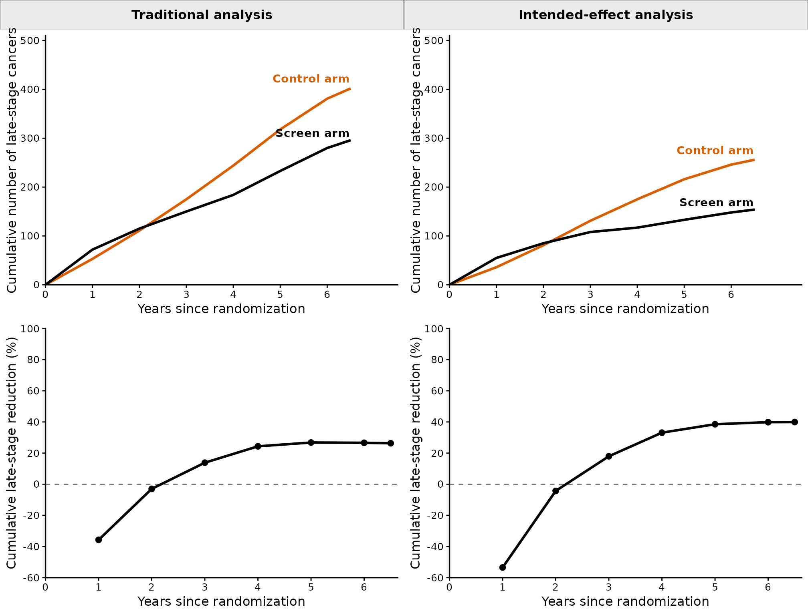
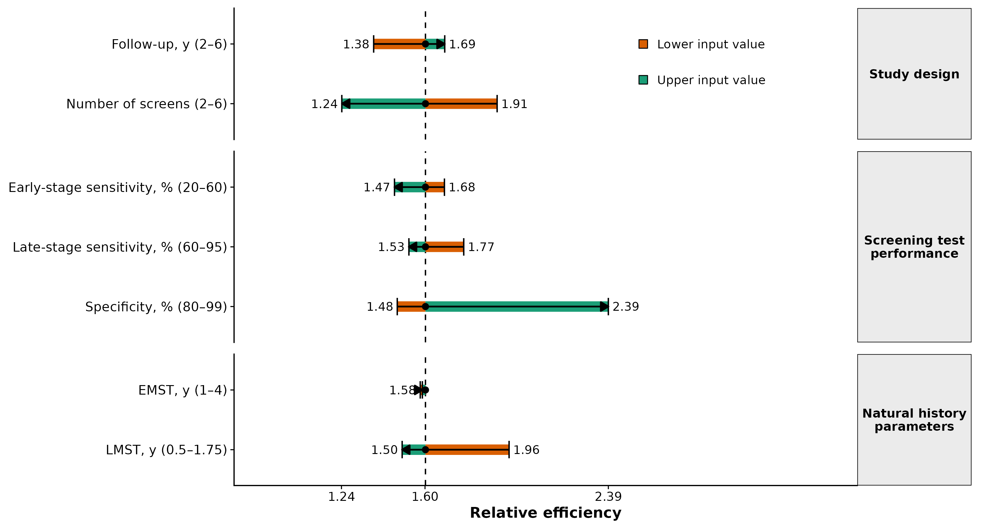
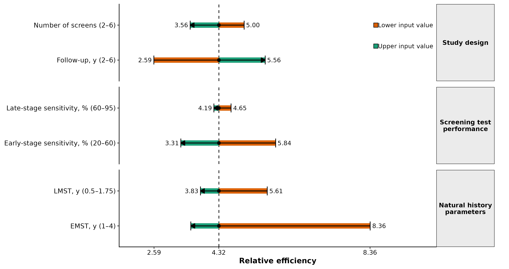
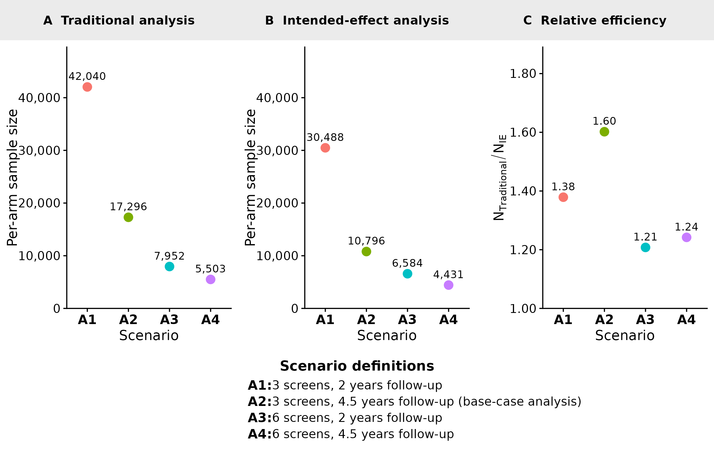
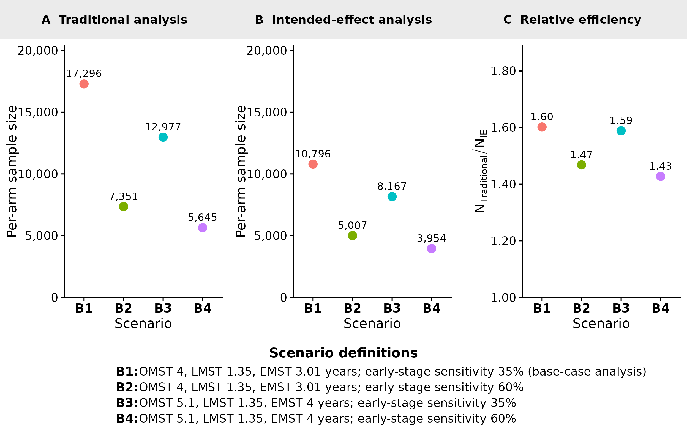
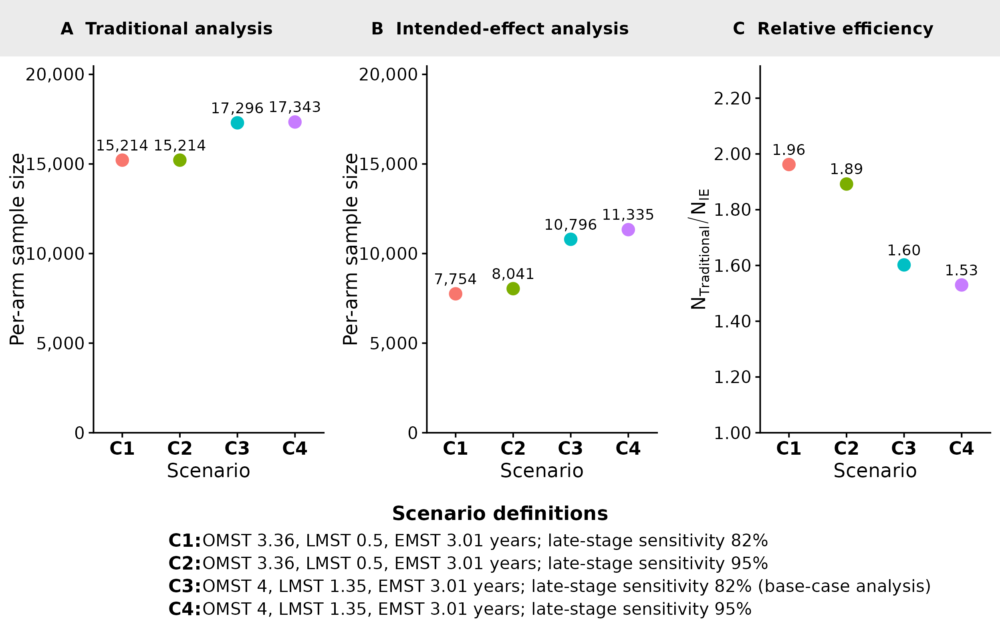
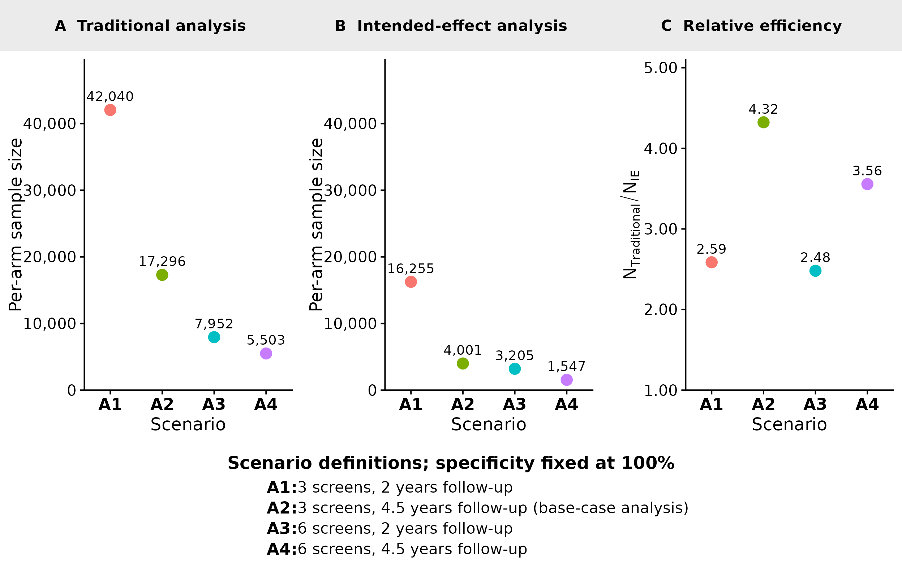
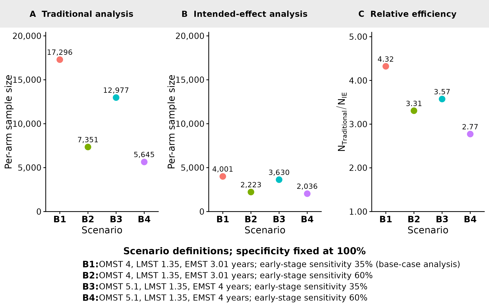
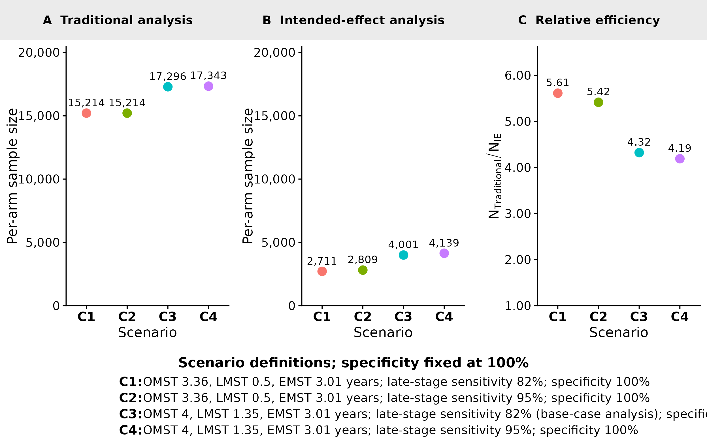

# Reproducing the analyses in "Power evaluation of cancer screening trial designs with incidence-based endpoints using a multi-state disease model"

## Overview

This vignette reproduces the results in the manuscript, laid out in the
same order and with the same figure and table numbers. In the main
analysis we use an NLST-like trial design — low-dose CT (LDCT) screening
versus no screening, with three annual screens and 4.5 years of
follow-up after the last screen — and estimate the required per-arm
sample size for both the traditional and intended-effect (IE) designs,
together with the relative efficiency of the IE design. We then carry
out one-way and joint-impact analyses that vary natural history
parameters, test performance, and trial design. Each analysis is shown
at the base-case specificity (86%) and repeated at 100% specificity
(reported as supplementary tables and figures).

The relative efficiency of the IE design is

``` math
\text{RE} = \frac{N_{\text{Traditional}}}{N_{\text{IE}}},
```

with values greater than 1 indicating that the IE design requires fewer
participants. Traditional rates are per 1,000 all randomized
participants; IE event rates are per 1,000 ever-positive participants;
never-positive rates are per 1,000 never-positive participants.

### Notation

**Outcome and design quantities:**

| Symbol | Definition |
|:---|:---|
| $`p_c`$, $`p_s`$ | late-stage probability in the control and screen arms (traditional; per 1,000 all randomized) |
| $`p`$ | pooled probability, traditional analysis |
| $`\theta`$ | relative risk, $`p_s/p_c`$ (traditional) |
| $`\pi`$ | ever-positive fraction (PPOS) |
| $`\rho_p = p_{c,IE}`$ | late-stage probability among ever-positive control-arm participants (per 1,000 ever-positive) |
| $`p_{s,IE}`$ | late-stage probability among ever-positive screen-arm participants (per 1,000 ever-positive) |
| $`p_{IE}`$ | pooled probability, intended-effect analysis |
| $`\theta_{IE}`$ | relative risk among ever-positive participants |
| $`\rho_n`$ | late-stage probability among never-positive participants (per 1,000 never-positive) |
| $`RD`$, $`RD_{IE}`$ | risk difference (traditional; projected intended-effect) |
| $`N_{trad}`$, $`N_{IE}`$ | required per-arm sample size |
| $`RE = N_{trad}/N_{IE}`$ | relative efficiency of the IE vs traditional design |

**Model input parameters:**

| Symbol | Definition |
|:---|:---|
| OMST, LMST, EMST | overall, late-stage, and early-stage mean sojourn time (OMST and LMST are chosen inputs; EMST is derived) |
| $`B_{early}`$, $`B_{late}`$ | early- and late-stage screening-test sensitivity |
| $`B_{spec}`$ | screening-test specificity |

### Figure 1. Natural-history model


The natural-history model has five disease states — no cancer, early-
and late-stage pre-clinical cancer, and early- and late-stage clinical
cancer — with latent onset states that allow a flexible, age-increasing
hazard (Lange et al., 2024). This schematic (Figure 1 of the manuscript)
is a fixed diagram, not regenerated by the analysis.

### Table 1. Outcomes projected from the natural-history model

Given the inputs below, the model projects the following end-of-trial
quantities (each indexed by trial duration $`T`$):

| Description | Notation |
|:---|:---|
| **Traditional design (all randomized participants)** |  |
| Probability of late-stage diagnosis, control arm | $`p_c(T)`$ |
| Probability of late-stage diagnosis, screen arm | $`p_s(T)`$ |
| **Intended-effect design (ever-positive participants)** |  |
| Ever-positive fraction | $`\pi(T)`$ |
| Probability of late-stage diagnosis among ever-positives, control arm | $`\rho_p(T) = p_{c,IE}(T)`$ |
| Probability of late-stage diagnosis among ever-positives, screen arm | $`p_{s,IE}(T)`$ |
| **Ever-negative participants** |  |
| Probability of late-stage diagnosis among ever-negatives | $`\rho_n(T)`$ |

### Table 2. Model input parameters

The lower, base-case (NLST), and upper values used across the
sensitivity analyses. For EMST and LMST, the corresponding OMST is
looked up (EMST) or remapped (LMST) from the calibrated model so that
the other sojourn time is held at its base-case value.

| Parameter | Base-case (NLST) | Range |
|:---|:---|:---|
| Early-stage mean sojourn time (EMST), years | 3.01 | 1.0–4.0 |
| Late-stage mean sojourn time (LMST), years | 1.35 | 0.5–1.75 |
| Early-stage sensitivity ($`B_{early}`$), % | 35 | 20–60 |
| Late-stage sensitivity ($`B_{late}`$), % | 82 | 60–95 |
| Specificity ($`B_{spec}`$), % | 86 | 80–99 |
| Number of screening rounds ($`n_{screens}`$) | 3 | 2–6 |
| Follow-up after the final screen ($`n_{follow}`$), years | 4.5 | 2.0–6.0 |

Table 2. Model input parameters (lower, base-case, and upper values).
{.table .table .table-striped .table-condensed
style="width: auto !important; margin-left: auto; margin-right: auto;"}

## Base-case analysis

We use an NLST-like design: an LDCT screen arm versus a non-screened
control arm, a cohort starting at age 62, 3 annual screens, and 4.5
years of follow-up after the final screen. Natural-history inputs follow
Lange et al. (2024): OMST 4 years, LMST 1.35 years (derived EMST 3.01
years), $`B_{early}`$ = 35%, $`B_{late}`$ = 82%. LDCT specificity was
calibrated so the model reproduces the 38% ever-positive proportion
reported for the NLST by Katki et al., giving a base-case specificity of
85.5% (reproducing an ever-positive proportion of 38%).

### Supplementary Table 1. Time-dependent late-stage outcomes

| Year | Traditional control, per all randomized arm | Traditional screen, per all randomized arm | Traditional reduction (%) | IE projected control, among ever-positive arm | IE screen, among ever-positive arm | IE reduction (%) |
|:---|---:|---:|---:|---:|---:|---:|
| 0 | 0 | 0 | NA | 0 | 0 | NA |
| 1 | 53 | 72 | -36 | 36 | 55 | -53 |
| 2 | 111 | 115 | -3 | 81 | 85 | -4 |
| 3 | 175 | 150 | 14 | 131 | 108 | 18 |
| 4 | 244 | 184 | 24 | 175 | 117 | 33 |
| 5 | 318 | 233 | 27 | 216 | 133 | 39 |
| 6 | 381 | 280 | 27 | 246 | 148 | 40 |
| 6.5 | 402 | 296 | 26 | 256 | 154 | 40 |

Supplementary Table 1. Time-dependent late-stage incidence outcomes
under traditional and IE analyses. {.table .table .table-striped
.table-condensed
style="width: auto !important; margin-left: auto; margin-right: auto;"}

Traditional counts use all randomized participants as the denominator;
IE counts are among ever-positive participants only.

### Supplementary Figure 1. Time-dependent late-stage outcomes



Cumulative late-stage counts over time. Traditional curves are counts
for the full randomized arm; IE curves are counts for the ever-positive
subgroup, using the effective arm size $`n \times \pi`$.

### Table 3. Base-case summary (86% and 100% specificity)

| Quantity | Specificity = 86% (base case) | Specificity = 100% |
|:---|---:|---:|
| Traditional analysis (per 1,000 all randomized) |  |  |
| Screen arm ($`p_s`$) | 11.1 | 11.1 |
| Control arm ($`p_c`$) | 15.0 | 15.0 |
| Pooled ($`p`$) | 13.1 | 13.1 |
| $`\theta`$ | 0.74 | 0.74 |
| RD | 4.0 | 4.0 |
| Ever-positive (intended-effect) analysis (per 1,000 ever-positive) |  |  |
| Control arm ($`\rho_p = p_{c,IE}`$) | 25.2 | 687.0 |
| Screen arm ($`p_{s,IE}`$) | 15.1 | 343.8 |
| Pooled ($`p_{IE}`$) | 20.1 | 515.4 |
| $`\theta_{IE}`$ | 0.60 | 0.50 |
| $`RD_{IE}`$ | 10.0 | 343.2 |
| $`\rho_n`$ | 8.7 | 7.4 |
| $`\pi`$ (%) | 38.0 | 1.1 |
| Sample size and efficiency |  |  |
| Per-arm $`N_{trad}`$ | 17,296 | 17,296 |
| Per-arm $`N_{IE}`$ | 10,796 | 4,001 |
| Reduction in sample size (%) | 37.6 | 76.9 |
| Relative efficiency ($`RE`$) | 1.60 | 4.32 |

Table 3. Traditional vs intended-effect outcomes under base-case (86%)
and 100% specificity. {.table .table .table-striped .table-condensed
style="width: auto !important; margin-left: auto; margin-right: auto;"}

Only the ever-positive (intended-effect) quantities change between the
two specificity assumptions; the traditional rows are identical because
specificity does not affect the traditional design.

## Scenario analyses

### One-way sensitivity analysis

#### Table 4. One-way sensitivity analysis

| Group | Parameter | Input range | $`p_c`$ | $`p_s`$ | $`p`$ | $`\theta`$ | RD | $`\rho_p`$ | $`p_{s,IE}`$ | $`p_{IE}`$ | $`\theta_{IE}`$ | $`RD_{IE}`$ | $`\pi`$ (%) | $`\rho_n`$ | $`N_{trad}`$ | $`N_{IE}`$ | $`RE`$ | Relationship |
|:---|:---|:---|:---|:---|:---|:---|:---|:---|:---|:---|:---|:---|:---|:---|:---|:---|:---|:---|
| Study design | Number of screens | 2–6 | 12.2–24.8 | 9.6–16.0 | 10.9–20.4 | 0.79–0.65 | 2.6–8.7 | 24.2–31.3 | 15.1–17.8 | 19.7–24.5 | 0.62–0.57 | 9.1–13.6 | 27.4–61.5 | 7.6–13.8 | 34,251–5,503 | 17,926–4,431 | 1.91–1.24 | Decreases |
| Study design | Follow-up years | 2–6 | 8.3–19.7 | 6.4–15.0 | 7.4–17.3 | 0.77–0.76 | 1.9–4.7 | 16.1–30.4 | 11.2–18.7 | 13.6–24.6 | 0.69–0.62 | 4.9–11.6 | 38.0–38.0 | 3.5–12.9 | 42,040–16,442 | 30,488–9,756 | 1.38–1.69 | Increases |
| Screening test performance | LDCT early-stage sensitivity | 20%–60% | 15.0–15.0 | 12.5–9.2 | 13.8–12.1 | 0.83–0.61 | 2.5–5.8 | 22.6–28.2 | 16.4–13.3 | 19.5–20.7 | 0.73–0.47 | 6.2–14.9 | 37.8–38.3 | 10.3–6.7 | 46,348–7,351 | 27,520–5,007 | 1.68–1.47 | Decreases |
| Screening test performance | LDCT late-stage sensitivity | 60%–95% | 15.0–15.0 | 11.1–11.1 | 13.0–13.1 | 0.74–0.74 | 4.0–4.0 | 23.3–26.1 | 13.2–16.1 | 18.3–21.1 | 0.57–0.62 | 10.1–10.0 | 38.0–38.1 | 9.9–8.1 | 17,195–17,343 | 9,729–11,335 | 1.77–1.53 | Decreases |
| Screening test performance | Specificity | 80%–99% | 15.0–15.0 | 11.1–11.1 | 13.1–13.1 | 0.74–0.74 | 4.0–4.0 | 20.7–193.2 | 12.9–98.5 | 16.8–145.9 | 0.62–0.51 | 7.8–94.7 | 49.2–4.0 | 9.4–7.5 | 17,296–17,296 | 11,678–7,235 | 1.48–2.39 | Increases |
| Natural history parameters | EMST | 1–4 | 14.9–15.1 | 12.8–10.5 | 13.9–12.8 | 0.86–0.70 | 2.1–4.5 | 23.1–25.8 | 17.9–14.3 | 20.5–20.0 | 0.77–0.55 | 5.2–11.5 | 37.8–38.2 | 9.8–8.3 | 64,826–12,977 | 41,059–8,167 | 1.58–1.59 | Stable/minimal change |
| Natural history parameters | LMST | 0.5–1.75 | 15.0–15.1 | 10.8–11.2 | 12.9–13.2 | 0.72–0.75 | 4.2–3.8 | 21.7–26.4 | 10.9–16.8 | 16.3–21.6 | 0.51–0.63 | 10.7–9.7 | 37.9–38.1 | 10.8–8.0 | 15,214–18,726 | 7,754–12,477 | 1.96–1.50 | Decreases |
| Note: |  |  |  |  |  |  |  |  |  |  |  |  |  |  |  |  |  |  |
|  Each cell shows the value at the parameter’s lower and upper bound (lower–upper). Rates are per 1,000 (p_c, p_s, p per all randomized; rho_p, p_s,IE, p_IE, RD_IE per ever-positive; rho_n per never-positive). For EMST, LMST is held at base case; for LMST, OMST is remapped to preserve base-case EMST. |  |  |  |  |  |  |  |  |  |  |  |  |  |  |  |  |  |  |

Table 4. One-way sensitivity analysis (base-case 86% specificity).
{.table .table .table-striped .table-condensed
style="width: auto !important; margin-left: auto; margin-right: auto;border-bottom: 0;"}

#### Figure 2. One-way sensitivity analyses



Change in IE relative efficiency as each input moves from its lower to
upper value, at base-case 86% specificity.

#### Supplementary Table 2. One-way sensitivity, 100% specificity

| Group | Parameter | Input range | $`p_c`$ | $`p_s`$ | $`p`$ | $`\theta`$ | RD | $`\rho_p`$ | $`p_{s,IE}`$ | $`p_{IE}`$ | $`\theta_{IE}`$ | $`RD_{IE}`$ | $`\pi`$ (%) | $`\rho_n`$ | $`N_{trad}`$ | $`N_{IE}`$ | $`RE`$ | Relationship |
|:---|:---|:---|:---|:---|:---|:---|:---|:---|:---|:---|:---|:---|:---|:---|:---|:---|:---|:---|
| Study design | Number of screens | 2–6 | 12.2–24.8 | 9.6–16.0 | 10.9–20.4 | 0.79–0.65 | 2.6–8.7 | 674.3–717.0 | 366.9–311.0 | 520.6–514.0 | 0.54–0.43 | 307.4–406.0 | 0.8–2.1 | 6.8–10.0 | 34,251–5,503 | 6,856–1,547 | 5.00–3.56 | Decreases |
| Study design | Follow-up years | 2–6 | 8.3–19.7 | 6.4–15.0 | 7.4–17.3 | 0.77–0.76 | 1.9–4.7 | 512.3–741.6 | 343.8–343.8 | 428.1–542.7 | 0.67–0.46 | 168.6–397.8 | 1.1–1.1 | 2.6–11.4 | 42,040–16,442 | 16,255–2,958 | 2.59–5.56 | Increases |
| Screening test performance | LDCT early-stage sensitivity | 20%–60% | 15.0–15.0 | 12.5–9.2 | 13.8–12.1 | 0.83–0.61 | 2.5–5.8 | 744.6–643.6 | 476.8–236.0 | 610.7–439.8 | 0.64–0.37 | 267.8–407.7 | 0.9–1.4 | 8.5–6.0 | 46,348–7,351 | 7,940–2,223 | 5.84–3.31 | Decreases |
| Screening test performance | LDCT late-stage sensitivity | 60%–95% | 15.0–15.0 | 11.1–11.1 | 13.0–13.1 | 0.74–0.74 | 4.0–4.0 | 664.7–697.1 | 295.0–366.0 | 479.9–531.6 | 0.44–0.52 | 369.8–331.2 | 1.0–1.2 | 8.2–7.0 | 17,195–17,343 | 3,700–4,139 | 4.65–4.19 | Decreases |
| Natural history parameters | EMST | 1–4 | 14.9–15.1 | 12.8–10.5 | 13.9–12.8 | 0.86–0.70 | 2.1–4.5 | 856.2–604.8 | 577.3–279.6 | 716.8–442.2 | 0.67–0.46 | 278.9–325.2 | 0.7–1.3 | 8.9–6.9 | 64,826–12,977 | 7,750–3,630 | 8.36–3.57 | Decreases |
| Natural history parameters | LMST | 0.5–1.75 | 15.0–15.1 | 10.8–11.2 | 12.9–13.2 | 0.72–0.75 | 4.2–3.8 | 666.6–662.8 | 197.7–371.2 | 432.1–517.0 | 0.30–0.56 | 468.9–291.6 | 0.9–1.3 | 9.2–6.7 | 15,214–18,726 | 2,711–4,888 | 5.61–3.83 | Decreases |
| Note: |  |  |  |  |  |  |  |  |  |  |  |  |  |  |  |  |  |  |
|  Each cell shows the value at the parameter’s lower and upper bound (lower–upper); rates per 1,000. Specificity is fixed at 100% and not varied. |  |  |  |  |  |  |  |  |  |  |  |  |  |  |  |  |  |  |

Supplementary Table 2. One-way sensitivity analysis at 100% specificity.
{.table .table .table-striped .table-condensed
style="width: auto !important; margin-left: auto; margin-right: auto;border-bottom: 0;"}

#### Supplementary Figure 2. One-way sensitivity analyses, 100% specificity



### Joint-impact analysis

#### Table 5. Joint impact of study design parameters

| Scenario | Definition | EMST | Matched OMST | LMST | $`\pi`$ (%) | $`p_c`$ | $`p_s`$ | $`p`$ | $`\theta`$ | RD | $`\rho_p`$ | $`p_{s,IE}`$ | $`p_{IE}`$ | $`\rho_n`$ | $`\theta_{IE}`$ | $`RD_{IE}`$ | Projected $`RD_{IE}`$ | $`N_{trad}`$ | $`N_{IE}`$ | $`RE`$ | Sample size reduction (%) | Traditional stage shift (%) | IE stage shift (%) |
|:---|:---|---:|---:|---:|:---|:---|:---|:---|:---|:---|:---|:---|:---|:---|:---|:---|:---|:---|:---|:---|:---|:---|:---|
| A1 | 3 screens, 2 years follow-up | 3.01 | 4 | 1.35 | 38.0 | 8.3 | 6.4 | 7.4 | 0.77 | 1.9 | 16.1 | 11.2 | 13.6 | 3.5 | 0.69 | 4.9 | 1.9 | 42,040 | 30,488 | 1.38 | 27.5 | 23.0 | 30.7 |
| A2 | 3 screens, 4.5 years follow-up (base-case analysis) | 3.01 | 4 | 1.35 | 38.0 | 15.0 | 11.1 | 13.1 | 0.74 | 4.0 | 25.2 | 15.1 | 20.1 | 8.7 | 0.60 | 10.0 | 3.8 | 17,296 | 10,796 | 1.60 | 37.6 | 26.3 | 39.9 |
| A3 | 6 screens, 2 years follow-up | 3.01 | 4 | 1.35 | 61.5 | 16.5 | 10.6 | 13.5 | 0.64 | 5.9 | 22.0 | 12.6 | 17.3 | 7.5 | 0.57 | 9.4 | 5.8 | 7,952 | 6,584 | 1.21 | 17.2 | 36.0 | 42.7 |
| A4 | 6 screens, 4.5 years follow-up | 3.01 | 4 | 1.35 | 61.5 | 24.8 | 16.0 | 20.4 | 0.65 | 8.7 | 31.3 | 17.8 | 24.5 | 13.8 | 0.57 | 13.6 | 8.4 | 5,503 | 4,431 | 1.24 | 19.5 | 35.3 | 43.4 |

Table 5. Joint impact of study design parameters (86% specificity).
{.table .table .table-striped .table-condensed
style="width: auto !important; margin-left: auto; margin-right: auto;"}

#### Table 6. Joint impact of EMST and early-stage sensitivity

| Scenario | Definition | EMST | Matched OMST | LMST | $`\pi`$ (%) | $`p_c`$ | $`p_s`$ | $`p`$ | $`\theta`$ | RD | $`\rho_p`$ | $`p_{s,IE}`$ | $`p_{IE}`$ | $`\rho_n`$ | $`\theta_{IE}`$ | $`RD_{IE}`$ | Projected $`RD_{IE}`$ | $`N_{trad}`$ | $`N_{IE}`$ | $`RE`$ | Sample size reduction (%) | Traditional stage shift (%) | IE stage shift (%) |
|:---|:---|---:|---:|---:|:---|:---|:---|:---|:---|:---|:---|:---|:---|:---|:---|:---|:---|:---|:---|:---|:---|:---|:---|
| B1 | OMST 4, LMST 1.35, EMST 3.01 years; early-stage sensitivity 35% (base-case analysis) | 3.01 | 4.0 | 1.35 | 38.0 | 15.0 | 11.1 | 13.1 | 0.74 | 4.0 | 25.2 | 15.1 | 20.1 | 8.7 | 0.60 | 10.0 | 3.8 | 17,296 | 10,796 | 1.60 | 37.6 | 26.3 | 39.9 |
| B2 | OMST 4, LMST 1.35, EMST 3.01 years; early-stage sensitivity 60% | 3.01 | 4.0 | 1.35 | 38.3 | 15.0 | 9.2 | 12.1 | 0.61 | 5.8 | 28.2 | 13.3 | 20.7 | 6.7 | 0.47 | 14.9 | 5.7 | 7,351 | 5,007 | 1.47 | 31.9 | 38.9 | 52.9 |
| B3 | OMST 5.1, LMST 1.35, EMST 4 years; early-stage sensitivity 35% | 4.10 | 5.1 | 1.35 | 38.2 | 15.1 | 10.5 | 12.8 | 0.70 | 4.5 | 25.8 | 14.3 | 20.0 | 8.3 | 0.55 | 11.5 | 4.4 | 12,977 | 8,167 | 1.59 | 37.1 | 30.0 | 44.6 |
| B4 | OMST 5.1, LMST 1.35, EMST 4 years; early-stage sensitivity 60% | 4.10 | 5.1 | 1.35 | 38.5 | 15.1 | 8.5 | 11.8 | 0.56 | 6.6 | 29.1 | 12.4 | 20.8 | 6.2 | 0.42 | 16.8 | 6.4 | 5,645 | 3,954 | 1.43 | 30.0 | 43.7 | 57.5 |
| Note: |  |  |  |  |  |  |  |  |  |  |  |  |  |  |  |  |  |  |  |  |  |  |  |
|  LMST is fixed at 1.35 years; for non-base EMST, OMST is the matched value from the calibrated model. |  |  |  |  |  |  |  |  |  |  |  |  |  |  |  |  |  |  |  |  |  |  |  |

Table 6. Joint impact of EMST and LDCT early-stage sensitivity (86%
specificity). {.table .table .table-striped .table-condensed
style="width: auto !important; margin-left: auto; margin-right: auto;border-bottom: 0;"}

#### Table 7. Joint impact of LMST and late-stage sensitivity

| Scenario | Definition | EMST | Matched OMST | LMST | $`\pi`$ (%) | $`p_c`$ | $`p_s`$ | $`p`$ | $`\theta`$ | RD | $`\rho_p`$ | $`p_{s,IE}`$ | $`p_{IE}`$ | $`\rho_n`$ | $`\theta_{IE}`$ | $`RD_{IE}`$ | Projected $`RD_{IE}`$ | $`N_{trad}`$ | $`N_{IE}`$ | $`RE`$ | Sample size reduction (%) | Traditional stage shift (%) | IE stage shift (%) |
|:---|:---|---:|---:|---:|:---|:---|:---|:---|:---|:---|:---|:---|:---|:---|:---|:---|:---|:---|:---|:---|:---|:---|:---|
| C1 | OMST 3.36, LMST 0.5, EMST 3.01 years; late-stage sensitivity 82% | 3.00 | 3.36 | 0.50 | 37.9 | 15.0 | 10.8 | 12.9 | 0.72 | 4.2 | 21.7 | 10.9 | 16.3 | 10.8 | 0.51 | 10.7 | 4.1 | 15,214 | 7,754 | 1.96 | 49.0 | 28.0 | 49.5 |
| C2 | OMST 3.36, LMST 0.5, EMST 3.01 years; late-stage sensitivity 95% | 3.00 | 3.36 | 0.50 | 37.9 | 15.0 | 10.8 | 12.9 | 0.72 | 4.2 | 22.3 | 11.6 | 16.9 | 10.4 | 0.52 | 10.7 | 4.1 | 15,214 | 8,041 | 1.89 | 47.1 | 28.0 | 48.1 |
| C3 | OMST 4, LMST 1.35, EMST 3.01 years; late-stage sensitivity 82% (base-case analysis) | 3.01 | 4.00 | 1.35 | 38.0 | 15.0 | 11.1 | 13.1 | 0.74 | 4.0 | 25.2 | 15.1 | 20.1 | 8.7 | 0.60 | 10.0 | 3.8 | 17,296 | 10,796 | 1.60 | 37.6 | 26.3 | 39.9 |
| C4 | OMST 4, LMST 1.35, EMST 3.01 years; late-stage sensitivity 95% | 3.01 | 4.00 | 1.35 | 38.1 | 15.0 | 11.1 | 13.1 | 0.74 | 4.0 | 26.1 | 16.1 | 21.1 | 8.1 | 0.62 | 10.0 | 3.8 | 17,343 | 11,335 | 1.53 | 34.6 | 26.3 | 38.4 |
| Note: |  |  |  |  |  |  |  |  |  |  |  |  |  |  |  |  |  |  |  |  |  |  |  |
|  For LMST analyses, OMST is remapped to keep EMST close to the base-case value. |  |  |  |  |  |  |  |  |  |  |  |  |  |  |  |  |  |  |  |  |  |  |  |

Table 7. Joint impact of LMST and LDCT late-stage sensitivity (86%
specificity). {.table .table .table-striped .table-condensed
style="width: auto !important; margin-left: auto; margin-right: auto;border-bottom: 0;"}

#### Figure 3. Joint impact of study design parameters



#### Figure 4. Joint impact of EMST and early-stage sensitivity



#### Figure 5. Joint impact of LMST and late-stage sensitivity



#### Supplementary Table 3. Joint impact of study design, 100% specificity

| Scenario | Definition | EMST | Matched OMST | LMST | $`\pi`$ (%) | $`p_c`$ | $`p_s`$ | $`p`$ | $`\theta`$ | RD | $`\rho_p`$ | $`p_{s,IE}`$ | $`p_{IE}`$ | $`\rho_n`$ | $`\theta_{IE}`$ | $`RD_{IE}`$ | Projected $`RD_{IE}`$ | $`N_{trad}`$ | $`N_{IE}`$ | $`RE`$ | Sample size reduction (%) | Traditional stage shift (%) | IE stage shift (%) |
|:---|:---|---:|---:|---:|:---|:---|:---|:---|:---|:---|:---|:---|:---|:---|:---|:---|:---|:---|:---|:---|:---|:---|:---|
| A1 | 3 screens, 2 years follow-up | 3.01 | 4 | 1.35 | 1.1 | 8.3 | 6.4 | 7.4 | 0.77 | 1.9 | 512.3 | 343.8 | 428.1 | 2.6 | 0.67 | 168.6 | 1.9 | 42,040 | 16,255 | 2.59 | 61.3 | 23.0 | 32.9 |
| A2 | 3 screens, 4.5 years follow-up (base-case analysis) | 3.01 | 4 | 1.35 | 1.1 | 15.0 | 11.1 | 13.1 | 0.74 | 4.0 | 687.0 | 343.8 | 515.4 | 7.4 | 0.50 | 343.2 | 3.8 | 17,296 | 4,001 | 4.32 | 76.9 | 26.3 | 50.0 |
| A3 | 6 screens, 2 years follow-up | 3.01 | 4 | 1.35 | 2.1 | 16.5 | 10.6 | 13.5 | 0.64 | 5.9 | 591.8 | 311.0 | 451.4 | 4.3 | 0.53 | 280.9 | 5.8 | 7,952 | 3,205 | 2.48 | 59.7 | 36.0 | 47.5 |
| A4 | 6 screens, 4.5 years follow-up | 3.01 | 4 | 1.35 | 2.1 | 24.8 | 16.0 | 20.4 | 0.65 | 8.7 | 717.0 | 311.0 | 514.0 | 10.0 | 0.43 | 406.0 | 8.4 | 5,503 | 1,547 | 3.56 | 71.9 | 35.3 | 56.6 |

Supplementary Table 3. Joint impact of study design parameters at 100%
specificity. {.table .table .table-striped .table-condensed
style="width: auto !important; margin-left: auto; margin-right: auto;"}

#### Supplementary Table 4. Joint impact of EMST, 100% specificity

| Scenario | Definition | EMST | Matched OMST | LMST | $`\pi`$ (%) | $`p_c`$ | $`p_s`$ | $`p`$ | $`\theta`$ | RD | $`\rho_p`$ | $`p_{s,IE}`$ | $`p_{IE}`$ | $`\rho_n`$ | $`\theta_{IE}`$ | $`RD_{IE}`$ | Projected $`RD_{IE}`$ | $`N_{trad}`$ | $`N_{IE}`$ | $`RE`$ | Sample size reduction (%) | Traditional stage shift (%) | IE stage shift (%) |
|:---|:---|---:|---:|---:|:---|:---|:---|:---|:---|:---|:---|:---|:---|:---|:---|:---|:---|:---|:---|:---|:---|:---|:---|
| B1 | OMST 4, LMST 1.35, EMST 3.01 years; early-stage sensitivity 35% (base-case analysis) | 3.01 | 4.0 | 1.35 | 1.1 | 15.0 | 11.1 | 13.1 | 0.74 | 4.0 | 687.0 | 343.8 | 515.4 | 7.4 | 0.50 | 343.2 | 3.8 | 17,296 | 4,001 | 4.32 | 76.9 | 26.3 | 50.0 |
| B2 | OMST 4, LMST 1.35, EMST 3.01 years; early-stage sensitivity 60% | 3.01 | 4.0 | 1.35 | 1.4 | 15.0 | 9.2 | 12.1 | 0.61 | 5.8 | 643.6 | 236.0 | 439.8 | 6.0 | 0.37 | 407.7 | 5.7 | 7,351 | 2,223 | 3.31 | 69.8 | 38.9 | 63.3 |
| B3 | OMST 5.1, LMST 1.35, EMST 4 years; early-stage sensitivity 35% | 4.10 | 5.1 | 1.35 | 1.3 | 15.1 | 10.5 | 12.8 | 0.70 | 4.5 | 604.8 | 279.6 | 442.2 | 6.9 | 0.46 | 325.2 | 4.4 | 12,977 | 3,630 | 3.57 | 72.0 | 30.0 | 53.8 |
| B4 | OMST 5.1, LMST 1.35, EMST 4 years; early-stage sensitivity 60% | 4.10 | 5.1 | 1.35 | 1.7 | 15.1 | 8.5 | 11.8 | 0.56 | 6.6 | 563.4 | 187.9 | 375.6 | 5.4 | 0.33 | 375.5 | 6.4 | 5,645 | 2,036 | 2.77 | 63.9 | 43.7 | 66.7 |

Supplementary Table 4. Joint impact of EMST and early-stage sensitivity
at 100% specificity. {.table .table .table-striped .table-condensed
style="width: auto !important; margin-left: auto; margin-right: auto;"}

#### Supplementary Table 5. Joint impact of LMST, 100% specificity

| Scenario | Definition | EMST | Matched OMST | LMST | $`\pi`$ (%) | $`p_c`$ | $`p_s`$ | $`p`$ | $`\theta`$ | RD | $`\rho_p`$ | $`p_{s,IE}`$ | $`p_{IE}`$ | $`\rho_n`$ | $`\theta_{IE}`$ | $`RD_{IE}`$ | Projected $`RD_{IE}`$ | $`N_{trad}`$ | $`N_{IE}`$ | $`RE`$ | Sample size reduction (%) | Traditional stage shift (%) | IE stage shift (%) |
|:---|:---|---:|---:|---:|:---|:---|:---|:---|:---|:---|:---|:---|:---|:---|:---|:---|:---|:---|:---|:---|:---|:---|:---|
| C1 | OMST 3.36, LMST 0.5, EMST 3.01 years; late-stage sensitivity 82%; specificity 100% | 3.00 | 3.36 | 0.50 | 0.9 | 15.0 | 10.8 | 12.9 | 0.72 | 4.2 | 666.6 | 197.7 | 432.1 | 9.2 | 0.30 | 468.9 | 4.1 | 15,214 | 2,711 | 5.61 | 82.2 | 28.0 | 70.3 |
| C2 | OMST 3.36, LMST 0.5, EMST 3.01 years; late-stage sensitivity 95%; specificity 100% | 3.00 | 3.36 | 0.50 | 0.9 | 15.0 | 10.8 | 12.9 | 0.72 | 4.2 | 675.8 | 219.9 | 447.8 | 9.0 | 0.33 | 455.9 | 4.1 | 15,214 | 2,809 | 5.42 | 81.5 | 28.0 | 67.5 |
| C3 | OMST 4, LMST 1.35, EMST 3.01 years; late-stage sensitivity 82% (base-case analysis); specificity 100% | 3.01 | 4.00 | 1.35 | 1.1 | 15.0 | 11.1 | 13.1 | 0.74 | 4.0 | 687.0 | 343.8 | 515.4 | 7.4 | 0.50 | 343.2 | 3.8 | 17,296 | 4,001 | 4.32 | 76.9 | 26.3 | 50.0 |
| C4 | OMST 4, LMST 1.35, EMST 3.01 years; late-stage sensitivity 95%; specificity 100% | 3.01 | 4.00 | 1.35 | 1.2 | 15.0 | 11.1 | 13.1 | 0.74 | 4.0 | 697.1 | 366.0 | 531.6 | 7.0 | 0.52 | 331.2 | 3.8 | 17,343 | 4,139 | 4.19 | 76.1 | 26.3 | 47.5 |

Supplementary Table 5. Joint impact of LMST and late-stage sensitivity
at 100% specificity. {.table .table .table-striped .table-condensed
style="width: auto !important; margin-left: auto; margin-right: auto;"}

#### Supplementary Figure 3. Joint impact of study design, 100% specificity



#### Supplementary Figure 4. Joint impact of EMST, 100% specificity



#### Supplementary Figure 5. Joint impact of LMST, 100% specificity


