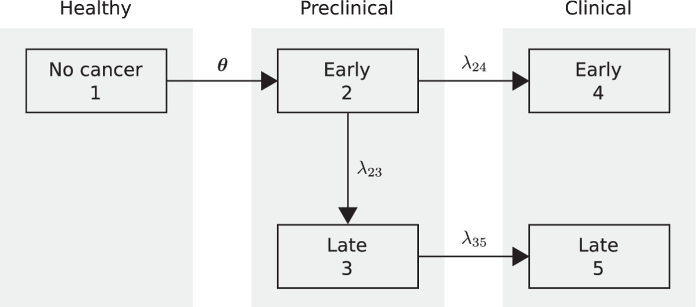

```{r setup, include=FALSE}
knitr::opts_chunk$set(echo = FALSE, warning = FALSE, message = FALSE)
library(mbiedesign)
library(dplyr)
library(tidyr)
library(ggplot2)
library(knitr)
library(purrr)
library(scales)
library(cowplot)
library(stringr)
library(kableExtra)
library(grid)
library(readr)

# Paper asset-export helpers are redirected to a throwaway temp directory so the
# vignette renders results inline without writing files into the package.
here <- function(...) file.path(tempdir(), ...)
for (d in c("results_figures", "results_tables", "results_data")) {
  dir.create(here(d), showWarnings = FALSE, recursive = TRUE)
}
```

# Overview

This vignette reproduces the results in the manuscript, laid out in the same
order and with the same figure and table numbers. In the main analysis we use an
NLST-like trial design — low-dose CT (LDCT) screening versus no screening, with
three annual screens and 4.5 years of follow-up after the last screen — and
estimate the required per-arm sample size for both the traditional and
intended-effect (IE) designs, together with the relative efficiency of the IE
design. We then carry out one-way and joint-impact analyses that vary natural
history parameters, test performance, and trial design. Each analysis is shown
at the base-case specificity (86%) and repeated at 100% specificity
(reported as supplementary tables and figures).

The relative efficiency of the IE design is

\[
\text{RE} = \frac{N_{\text{Traditional}}}{N_{\text{IE}}},
\]

with values greater than 1 indicating that the IE design requires fewer
participants. Traditional rates are per 1,000 all randomized participants; IE
event rates are per 1,000 ever-positive participants; never-positive rates are
per 1,000 never-positive participants.

## Notation

**Outcome and design quantities:**

| Symbol | Definition |
|:--|:--|
| $p_c$, $p_s$ | late-stage probability in the control and screen arms (traditional; per 1,000 all randomized) |
| $p$ | pooled probability, traditional analysis |
| $\theta$ | relative risk, $p_s/p_c$ (traditional) |
| $\pi$ | ever-positive fraction (PPOS) |
| $\rho_p = p_{c,IE}$ | late-stage probability among ever-positive control-arm participants (per 1,000 ever-positive) |
| $p_{s,IE}$ | late-stage probability among ever-positive screen-arm participants (per 1,000 ever-positive) |
| $p_{IE}$ | pooled probability, intended-effect analysis |
| $\theta_{IE}$ | relative risk among ever-positive participants |
| $\rho_n$ | late-stage probability among never-positive participants (per 1,000 never-positive) |
| $RD$, $RD_{IE}$ | risk difference (traditional; projected intended-effect) |
| $N_{trad}$, $N_{IE}$ | required per-arm sample size |
| $RE = N_{trad}/N_{IE}$ | relative efficiency of the IE vs traditional design |

**Model input parameters:**

| Symbol | Definition |
|:--|:--|
| OMST, LMST, EMST | overall, late-stage, and early-stage mean sojourn time (OMST and LMST are chosen inputs; EMST is derived) |
| $B_{early}$, $B_{late}$ | early- and late-stage screening-test sensitivity |
| $B_{spec}$ | screening-test specificity |

<!-- ================================================================= -->
<!-- SETUP AND ALL COMPUTATION (hidden). Every results object, figure,  -->
<!-- and table is built here so the presentation sections below are     -->
<!-- pure display in manuscript order.                                   -->
<!-- ================================================================= -->

```{r user-inputs}
cancer       <- "lung"
cancer_label <- "Lung"

base_vals <- list(
  OMST          = 4.00,
  LMST          = 1.35,
  sens_e_screen = 0.35,
  sens_l_screen = 0.82,
  specificity   = 0.855,
  numscreens    = 3,
  followup      = 4.5
)

base_vals_spec100             <- base_vals
base_vals_spec100$specificity <- 1.00

screen_int   <- 1
start_age    <- 62
n_control    <- 26722
n_screen     <- 26722
alpha        <- 0.025
target_power <- 0.90

fmt_pct <- function(x, digits = 1) paste0(round(100 * x, digits), "%")
fmt_num <- function(x, digits = 1) sprintf(paste0("%.", digits, "f"), x)
```

```{r load-models}
# Calibrated natural-history model provided with the package.
.fit <- load_fitted_model(cancer)
base_fit             <- .fit$base_fit
target_base_emst     <- .fit$base_emst
metadata_unified     <- .fit$metadata
out_unified          <- .fit$fits
matched_pairs_lookup <- .fit$matched_pairs
```

```{r model-helpers}
get_matched_row <- function(target_emst, lmst_val, tol = 0.01) {
  row <- matched_pairs_lookup |>
    dplyr::filter(
      abs(target_EMST - target_emst) <= tol,
      abs(LMST        - lmst_val)    <= tol
    ) |>
    dplyr::arrange(abs(target_EMST - target_emst) + abs(LMST - lmst_val)) |>
    dplyr::slice(1)
  if (nrow(row) == 0) {
    stop("No matched pair found for target_EMST = ", target_emst,
         " and LMST = ", lmst_val, ".")
  }
  row
}

get_matched_omst <- function(target_emst, lmst_val) {
  get_matched_row(target_emst, lmst_val)$matched_OMST
}

get_source <- function(target_emst, lmst_val) {
  row <- get_matched_row(target_emst, lmst_val)
  if (is.na(row$fitID)) "selected" else "unified"
}

find_fit_id <- function(metadata, OMST, LMST, tol = 0.06) {
  fit_row <- metadata |>
    dplyr::mutate(
      diff = abs(.data$OMST - .env$OMST) + abs(.data$DMST - .env$LMST)
    ) |>
    dplyr::filter(
      abs(.data$OMST - .env$OMST) <= tol,
      abs(.data$DMST - .env$LMST) <= tol
    ) |>
    dplyr::arrange(diff)
  if (nrow(fit_row) == 0) {
    stop("No fitted model found for OMST = ", OMST, " and LMST = ", LMST, ".")
  }
  fit_row$fitID[1]
}

get_fit_object <- function(OMST, LMST, source = c("selected", "unified")) {
  source <- match.arg(source)
  if (source == "selected") {
    return(list(fitID = NA_integer_, fit = base_fit))
  }
  fit_id <- find_fit_id(metadata_unified, OMST, LMST)
  fit    <- out_unified[[fit_id]]
  list(fitID = fit_id, fit = fit)
}

get_rate_matrix <- function(OMST, LMST, source = c("selected", "unified")) {
  get_fit_object(OMST, LMST, source)$fit$rate.matrix
}

get_emst_for_pair <- function(OMST, LMST, source = c("selected", "unified")) {
  source <- match.arg(source)
  fit    <- get_fit_object(OMST, LMST, source)$fit
  as.numeric(fit$summary_out$EMST)
}

base_emst <- target_base_emst
```

```{r table-and-plot-helpers}
write_tex <- function(tex_code, filename) {
  writeLines(tex_code, here("results_tables", filename))
}

write_latex_table <- function(dset, filename, caption) {
  writeLines(
    knitr::kable(dset, format = "latex", booktabs = TRUE, caption = caption),
    here("results_tables", filename)
  )
}

save_plot_all_formats <- function(plot, filename, width, height, dpi = 600) {
  # No-op in the vignette (figures render inline). The paper build overrides
  # this to write 600-dpi PNG/PDF asset files.
  invisible(NULL)
}

paper_theme <- function(base_size = 20) {
  theme_classic(base_size = base_size) +
    theme(
      plot.background  = element_rect(fill = "white", color = NA),
      panel.background = element_rect(fill = "white", color = NA),
      axis.text        = element_text(color = "black"),
      axis.title       = element_text(color = "black"),
      axis.line.x      = element_line(color = "black", linewidth = 0.6),
      axis.line.y      = element_line(color = "black", linewidth = 0.6),
      axis.ticks       = element_line(color = "black", linewidth = 0.5),
      strip.background = element_rect(fill = "grey92", color = NA),
      strip.text       = element_text(color = "black"),
      legend.position  = "none"
    )
}
```

```{r specificity-calibration}
calibrate_specificity_to_ppos <- function(target_ppos, OMST, LMST,
                                          sens_e_screen, sens_l_screen,
                                          numscreens, source = "selected") {
  rate_matrix  <- get_rate_matrix(OMST, LMST, source = source)
  screen_times <- seq(0, (numscreens - 1) * screen_int, by = screen_int)
  objective <- function(sp) {
    get_positivity_rate(
      sens_e       = sens_e_screen,
      sens_l       = sens_l_screen,
      specificity  = sp,
      screen_times = screen_times,
      start_age    = start_age,
      rate_matrix  = rate_matrix
    ) - target_ppos
  }
  uniroot(objective, interval = c(0.50, 0.999999))$root
}

nlst_target_ppos      <- 0.38
calibrated_specificity <- calibrate_specificity_to_ppos(
  target_ppos   = nlst_target_ppos,
  OMST          = base_vals$OMST,
  LMST          = base_vals$LMST,
  sens_e_screen = base_vals$sens_e_screen,
  sens_l_screen = base_vals$sens_l_screen,
  numscreens    = base_vals$numscreens,
  source        = "selected")

base_calibration_rate_matrix  <- get_rate_matrix(base_vals$OMST, base_vals$LMST, source = "selected")
base_calibration_screen_times <- seq(0, (base_vals$numscreens - 1) * screen_int, by = screen_int)

ppos_at_base_specificity <- get_positivity_rate(
  sens_e       = base_vals$sens_e_screen,
  sens_l       = base_vals$sens_l_screen,
  specificity  = base_vals$specificity,
  screen_times = base_calibration_screen_times,
  start_age    = start_age,
  rate_matrix  = base_calibration_rate_matrix)
```

```{r core-functions}
run_trial_model <- function(OMST, LMST,
                            sens_e_screen, sens_l_screen,
                            specificity, numscreens, followup,
                            source = c("selected", "unified")) {
  source      <- match.arg(source)
  rate_matrix <- get_rate_matrix(OMST, LMST, source = source)
  get_trial_results_by_design(
    start_age             = start_age,
    numscreens            = numscreens,
    screen_int            = screen_int,
    num_followup_intervals= followup,
    rate_matrix           = rate_matrix,
    sens_e                = sens_e_screen,
    sens_l                = sens_l_screen,
    specificity           = specificity,
    n_control             = n_control,
    n_screen              = n_screen
  )
}

run_one_scenario <- function(OMST, LMST,
                             sens_e_screen, sens_l_screen,
                             specificity, numscreens, followup,
                             source = c("selected", "unified")) {
  source <- match.arg(source)
  res    <- run_trial_model(
    OMST = OMST, LMST = LMST,
    sens_e_screen = sens_e_screen, sens_l_screen = sens_l_screen,
    specificity = specificity, numscreens = numscreens, followup = followup,
    source = source
  )
  rate_matrix <- res$params$rate_matrix

  p_c_std <- tail(res$control$standard$late$incidence$cumulative$control_arm_detected, 1)
  p_s_std <- tail(res$screen$standard$late$incidence$cumulative$screen_arm_detected,   1)
  p_c_ie  <- tail(res$control$IE$late$incidence$cumulative$control_arm_detected,       1)
  p_s_ie  <- tail(res$screen$IE$late$incidence$cumulative$screen_arm_detected,         1)

  pi_pos <- get_positivity_rate(
    sens_e       = sens_e_screen,
    sens_l       = sens_l_screen,
    specificity  = specificity,
    screen_times = res$params$screen_times,
    start_age    = start_age,
    rate_matrix  = rate_matrix
  )

  rho_n_c <- ifelse(pi_pos < 1, (p_c_std - pi_pos * p_c_ie) / (1 - pi_pos), NA_real_)
  rho_n_s <- ifelse(pi_pos < 1, (p_s_std - pi_pos * p_s_ie) / (1 - pi_pos), NA_real_)
  rho_n   <- mean(c(rho_n_c, rho_n_s), na.rm = TRUE)

  R_alloc    <- n_screen / n_control
  p_pooled_std <- (p_c_std + R_alloc * p_s_std) / (1 + R_alloc)
  p_pooled_ie  <- (p_c_ie  + R_alloc * p_s_ie)  / (1 + R_alloc)

  n_std_total <- n_required_by_design(
    power = target_power, p_c = p_c_std, p_s = p_s_std,
    design = "traditional", alpha = alpha, R = R_alloc
  )
  n_ie_total <- n_required_by_design(
    power = target_power, p_c = p_c_ie, p_s = p_s_ie,
    design = "IE", alpha = alpha, R = R_alloc, pi_pos = pi_pos
  )

  n_std <- n_std_total / (1 + R_alloc)
  n_ie  <- n_ie_total  / (1 + R_alloc)

  EMST   <- get_emst_for_pair(OMST, LMST, source = source)
  rd_pos <- p_c_ie - p_s_ie
  rd_ie  <- pi_pos * rd_pos

  tibble::tibble(
    OMST = OMST, LMST = LMST, EMST = EMST,
    sens_e_screen = sens_e_screen, sens_l_screen = sens_l_screen,
    specificity = specificity, numscreens = numscreens, followup = followup,
    p_c_std = p_c_std, p_s_std = p_s_std, p_c_ie = p_c_ie, p_s_ie = p_s_ie,
    pi_pos = pi_pos, rho_n_c = rho_n_c, rho_n_s = rho_n_s, rho_n = rho_n,
    p_pooled_std = p_pooled_std, p_pooled_ie = p_pooled_ie,
    rr_std = p_s_std / p_c_std, rr_ie = p_s_ie / p_c_ie,
    rd_std = p_c_std - p_s_std, rd_pos = rd_pos, rd_ie = rd_ie,
    n_std_total = n_std_total, n_ie_total = n_ie_total,
    n_std = n_std, n_ie = n_ie,
    ie_gain = n_std / n_ie,
    sample_size_reduction = 100 * (1 - n_ie / n_std),
    stage_shift    = 100 * (p_c_std - p_s_std) / p_c_std,
    stage_shift_ie = 100 * (p_c_ie  - p_s_ie)  / p_c_ie
  )
}

run_custom_scenario <- function(
    OMST          = base_vals$OMST,
    LMST          = base_vals$LMST,
    sens_e_screen = base_vals$sens_e_screen,
    sens_l_screen = base_vals$sens_l_screen,
    specificity   = base_vals$specificity,
    numscreens    = base_vals$numscreens,
    followup      = base_vals$followup,
    source        = "selected") {
  run_one_scenario(
    OMST = OMST, LMST = LMST,
    sens_e_screen = sens_e_screen, sens_l_screen = sens_l_screen,
    specificity = specificity, numscreens = numscreens, followup = followup,
    source = source
  )
}

# make_joint_results: runs all scenarios and exposes all arm-level rates
# (p_c_std, p_s_std, p_c_ie [= rho_p], p_s_ie, rho_n, pooled p, pooled p_IE).
make_joint_results <- function(grid) {
  if (!"source" %in% names(grid)) grid$source <- "selected"
  grid |>
    dplyr::mutate(
      out = purrr::pmap(
        list(OMST, LMST, sens_e_screen, sens_l_screen, specificity, numscreens, followup, source),
        run_custom_scenario
      ),
      out = purrr::map(
        out,
        ~ dplyr::select(.x, -OMST, -LMST, -sens_e_screen, -sens_l_screen,
                        -specificity, -numscreens, -followup)
      )
    ) |>
    tidyr::unnest(out) |>
    dplyr::mutate(
      p_c_std_per1000              = p_c_std * 1000,
      p_s_std_per1000              = p_s_std * 1000,
      rho_p_per1000                = p_c_ie  * 1000,
      p_s_ie_per1000               = p_s_ie  * 1000,
      rho_n_per1000                = rho_n   * 1000,
      Pooled_std_per_1000          = p_pooled_std * 1000,
      Pooled_IE_per_1000           = p_pooled_ie  * 1000,
      N_trad                       = n_std,
      N_IE                         = n_ie,
      RE_IE                        = ie_gain,
      RD_standard_per_1000_all     = rd_std * 1000,
      RDpos_per_1000_ever_positive = rd_pos * 1000,
      RDIE_per_1000_all            = rd_ie  * 1000,
      Ppos_percent                 = pi_pos * 100
    )
}
```

```{r figure-1-functions}
extract_curve <- function(res, arm = c("control", "screen"), design = c("standard", "IE")) {
  arm    <- match.arg(arm)
  design <- match.arg(design)
  x <- res[[arm]][[design]]$late$incidence$cumulative
  if (!is.null(x$screen_arm_detected))  return(as.numeric(x$screen_arm_detected))
  if (!is.null(x$control_arm_detected)) return(as.numeric(x$control_arm_detected))
  stop("Could not find cumulative late-stage incidence vector for ", arm, " / ", design)
}

make_cumulative_df <- function(res, design_label, design_key,
                               n_control_plot, n_screen_plot) {
  control_vec <- extract_curve(res, "control", design_key)
  screen_vec  <- extract_curve(res, "screen",  design_key)
  max_time    <- base_vals$numscreens - 1 + base_vals$followup
  t_orig      <- seq(0, max_time, length.out = length(control_vec) + 1)
  control_vec <- c(0, control_vec)
  screen_vec  <- c(0, screen_vec)
  years           <- c(seq(0, floor(max_time)), max_time)
  control_interp  <- approx(t_orig, control_vec, xout = years)$y
  screen_interp   <- approx(t_orig, screen_vec,  xout = years)$y
  tibble::tibble(
    Year        = years,
    Control     = round(control_interp * n_control_plot, 0),
    Screen      = round(screen_interp  * n_screen_plot,  0),
    Stage_shift = ifelse(control_interp > 0,
                         100 * (control_interp - screen_interp) / control_interp,
                         NA_real_),
    Design = design_label
  )
}

make_curve_panel <- function(dset, design_label, ylab) {
  plot_data <- dset |>
    dplyr::filter(Design == design_label) |>
    dplyr::select(Year, Control, Screen) |>
    tidyr::pivot_longer(c(Control, Screen), names_to = "Arm", values_to = "Value")
  labels <- plot_data |>
    dplyr::group_by(Arm) |>
    dplyr::slice_max(Year, n = 1, with_ties = FALSE) |>
    dplyr::ungroup() |>
    dplyr::mutate(
      Year  = Year - 0.02,
      Value = Value + dplyr::case_when(Arm == "Control" ~ 20, Arm == "Screen" ~ 15, TRUE ~ 20),
      Arm_label = paste0(Arm, " arm")
    )
  ggplot(plot_data, aes(x = Year, y = Value, color = Arm)) +
    geom_line(linewidth = 1.1) +
    geom_text(data = labels, aes(label = Arm_label), hjust = 1, size = 3.8,
              fontface = "bold", show.legend = FALSE) +
    scale_color_manual(values = c("Control" = "#D95F02", "Screen" = "black")) +
    scale_x_continuous(
      breaks = seq(0, max(plot_data$Year, na.rm = TRUE), by = 1),
      limits = c(0, max(plot_data$Year, na.rm = TRUE) + 1.0),
      expand = expansion(mult = c(0, 0))
    ) +
    scale_y_continuous(
      limits = c(0, 500), breaks = seq(0, 500, by = 100),
      labels = scales::comma, expand = expansion(mult = c(0, 0.02))
    ) +
    labs(x = "Years since randomization", y = ylab) +
    paper_theme(base_size = 12) +
    theme(plot.title = element_blank())
}

make_shift_panel <- function(dset, design_label, ylab) {
  plot_data <- dset |> dplyr::filter(Design == design_label, !is.na(Stage_shift))
  ggplot(plot_data, aes(x = Year, y = Stage_shift)) +
    geom_hline(yintercept = 0, linetype = "dashed", linewidth = 0.5, color = "grey40") +
    geom_line(linewidth = 1.1, color = "black") +
    geom_point(size = 2.2, color = "black") +
    scale_x_continuous(
      breaks = seq(0, max(plot_data$Year, na.rm = TRUE), by = 1),
      limits = c(0, max(plot_data$Year, na.rm = TRUE)),
      expand = expansion(mult = c(0, 0.02))
    ) +
    scale_y_continuous(
      limits = c(-60, 100), breaks = seq(-60, 100, by = 20),
      labels = scales::label_number(accuracy = 1),
      expand = expansion(mult = c(0, 0))
    ) +
    labs(x = "Years since randomization", y = ylab) +
    paper_theme(base_size = 12) +
    theme(plot.title = element_blank())
}

make_header <- function(title_text) {
  grid::grobTree(
    grid::rectGrob(gp = grid::gpar(fill = "grey92", col = "black", lwd = 0.8)),
    grid::textGrob(title_text, x = 0.5, y = 0.5, just = "center",
                   gp = grid::gpar(fontface = "bold", fontsize = 12, col = "black"))
  )
}
```

```{r joint-impact-functions}
make_scenario_caption_panel <- function(dset, caption_title, x_start = 0.20) {
  label_df <- dset |>
    dplyr::distinct(Scenario, Scenario_label) |>
    dplyr::mutate(y = rev(dplyr::row_number()))
  ggplot(label_df) +
    geom_text(aes(x = x_start, y = y, label = paste0(Scenario, ":")),
              hjust = 0, size = 6, fontface = "bold", color = "black") +
    geom_text(aes(x = x_start + 0.04, y = y, label = Scenario_label),
              hjust = 0, size = 5.6, color = "black", lineheight = 1.1) +
    coord_cartesian(xlim = c(0, 1), ylim = c(0.5, nrow(label_df) + 0.5), clip = "off") +
    labs(title = caption_title) +
    theme_void(base_size = 18) +
    theme(plot.title  = element_text(size = 18, face = "bold", hjust = 0.5),
          plot.margin = margin(5, 30, 5, 30))
}

make_metric_header <- function(title_text, panel_label = NULL) {
  full_text <- if (!is.null(panel_label)) paste0(panel_label, "  ", title_text) else title_text
  grid::grobTree(
    grid::rectGrob(gp = grid::gpar(fill = "grey92", col = NA)),
    grid::textGrob(full_text, x = 0.5, y = 0.5, just = "center",
                   gp = grid::gpar(fontface = "bold", fontsize = 16, col = "black"))
  )
}

make_metric_plot <- function(dset, yvar, ylab, color_values,
                             y_limits = NULL, y_breaks = NULL) {
  dset <- dset |>
    dplyr::mutate(Scenario = factor(Scenario, levels = unique(Scenario)),
                  Scenario_num = as.numeric(Scenario))
  fmt_label <- function(x) {
    if (yvar %in% c("N_trad", "N_IE")) scales::comma(round(x))
    else sprintf("%.2f", x)
  }
  ggplot(dset, aes(x = Scenario_num, y = .data[[yvar]], color = Scenario)) +
    geom_point(size = 4.8) +
    geom_text(aes(label = fmt_label(.data[[yvar]])),
              vjust = -0.9, size = 5, color = "black", show.legend = FALSE) +
    scale_color_manual(values = color_values) +
    scale_x_continuous(
      breaks = seq_along(levels(dset$Scenario)),
      labels = levels(dset$Scenario),
      limits = c(0.5, max(dset$Scenario_num) + 0.5),
      expand = expansion(mult = c(0, 0))
    ) +
    scale_y_continuous(
      limits = y_limits, breaks = y_breaks,
      labels = if (yvar %in% c("N_trad", "N_IE")) scales::comma
               else scales::label_number(accuracy = 0.01),
      expand = expansion(mult = c(0, 0))
    ) +
    labs(x = "Scenario", y = ylab) +
    theme_classic(base_size = 18) +
    theme(
      plot.background  = element_rect(fill = "white", color = NA),
      panel.background = element_rect(fill = "white", color = NA),
      axis.line.x      = element_line(color = "black", linewidth = 0.7),
      axis.line.y      = element_line(color = "black", linewidth = 0.7),
      axis.ticks       = element_line(color = "black", linewidth = 0.7),
      axis.text        = element_text(color = "black", size = 16),
      axis.text.x      = element_text(face = "bold", size = 17),
      axis.title       = element_text(color = "black", size = 18),
      plot.title       = element_blank(),
      legend.position  = "none"
    )
}

make_joint_panel <- function(dset, caption_title, filename, caption_x_start = 0.11) {
  scenario_levels <- unique(dset$Scenario)
  dset <- dset |> dplyr::mutate(Scenario = factor(Scenario, levels = scenario_levels))
  color_values <- scales::hue_pal()(length(scenario_levels))
  names(color_values) <- scenario_levels
  ymax_n  <- max(c(dset$N_trad, dset$N_IE), na.rm = TRUE) * 1.18
  ymax_re <- max(dset$RE_IE, na.rm = TRUE) * 1.18
  h1 <- make_metric_header("Traditional analysis",     panel_label = "A")
  h2 <- make_metric_header("Intended-effect analysis", panel_label = "B")
  h3 <- make_metric_header("Relative efficiency",      panel_label = "C")
  p1 <- make_metric_plot(dset, "N_trad", "Per-arm sample size", color_values,
                         y_limits = c(0, ymax_n),
                         y_breaks = scales::pretty_breaks(n = 5)(c(0, ymax_n)))
  p2 <- make_metric_plot(dset, "N_IE", "Per-arm sample size", color_values,
                         y_limits = c(0, ymax_n),
                         y_breaks = scales::pretty_breaks(n = 5)(c(0, ymax_n)))
  p3 <- make_metric_plot(dset, "RE_IE", expression(N[Traditional] / N[IE]), color_values,
                         y_limits = c(1, ymax_re),
                         y_breaks = scales::pretty_breaks(n = 5)(c(1, ymax_re)))
  headers    <- cowplot::plot_grid(h1, h2, h3, nrow = 1)
  plots      <- cowplot::plot_grid(p1, p2, p3, nrow = 1, align = "hv", axis = "tblr")
  p_caption  <- make_scenario_caption_panel(dset, caption_title, x_start = caption_x_start)
  final_plot <- cowplot::plot_grid(headers, plots, p_caption,
                                   ncol = 1, rel_heights = c(0.13, 1, 0.32))
  save_plot_all_formats(final_plot, filename, width = 13, height = 8.2)
  final_plot
}

# write_joint_table: outputs all arm-level and pooled quantities per scenario.
write_joint_table <- function(dset, filename, caption) {
  out <- dset |>
    dplyr::transmute(
      Scenario,
      Definition                                      = Scenario_label,
      EMST                                            = round(EMST, 2),
      `Matched OMST`                                  = round(OMST, 2),
      LMST                                            = round(LMST, 2),
      `Ppos (%)`                                      = sprintf("%.1f", Ppos_percent),
      `p_c per 1,000 all randomized`                  = sprintf("%.1f", p_c_std_per1000),
      `p_s per 1,000 all randomized`                  = sprintf("%.1f", p_s_std_per1000),
      `Pooled p per 1,000 (traditional)`              = sprintf("%.1f", Pooled_std_per_1000),
      `RR standard`                                   = sprintf("%.2f", rr_std),
      `RD standard per 1,000 all randomized`          = sprintf("%.1f", RD_standard_per_1000_all),
      `rho_p per 1,000 ever-positive`                 = sprintf("%.1f", rho_p_per1000),
      `p_s_IE per 1,000 ever-positive`                = sprintf("%.1f", p_s_ie_per1000),
      `Pooled p_IE per 1,000 (IE)`                    = sprintf("%.1f", Pooled_IE_per_1000),
      `rho_n per 1,000 never-positive`                = sprintf("%.1f", rho_n_per1000),
      `RR IE`                                         = sprintf("%.2f", rr_ie),
      `RDpos per 1,000 ever-positive`                 = sprintf("%.1f", RDpos_per_1000_ever_positive),
      `RDIE per 1,000 all randomized`                 = sprintf("%.1f", RDIE_per_1000_all),
      `N Traditional`                                 = scales::comma(round(N_trad)),
      `N IE`                                          = scales::comma(round(N_IE)),
      `Relative efficiency`                           = sprintf("%.2f", RE_IE),
      `Sample size reduction (%)`                     = sprintf("%.1f", sample_size_reduction),
      `Traditional stage shift (%)`                   = sprintf("%.1f", stage_shift),
      `IE stage shift (%)`                            = sprintf("%.1f", stage_shift_ie)
    )
  names(out) <- c("Scenario", "Definition", "EMST", "Matched OMST", "LMST",
    "$\\pi$ (%)", "$p_c$", "$p_s$", "$p$", "$\\theta$", "RD",
    "$\\rho_p$", "$p_{s,IE}$", "$p_{IE}$", "$\\rho_n$", "$\\theta_{IE}$",
    "$RD_{IE}$", "Projected $RD_{IE}$", "$N_{trad}$", "$N_{IE}$", "$RE$",
    "Sample size reduction (%)", "Traditional stage shift (%)", "IE stage shift (%)")
  write_latex_table(out, filename, caption)
  readr::write_csv(out, here("results_data", sub("\\.tex$", ".csv", filename)))
  invisible(out)
}
```

```{r tornado-functions}
format_setting <- function(param, x) {
  dplyr::case_when(
    stringr::str_detect(param, "sensitivity|Specificity") ~ paste0(round(x * 100, 1), "%"),
    TRUE ~ as.character(round(x, 2))
  )
}

format_range_label <- function(param, low, high) {
  dplyr::case_when(
    param == "LDCT early-stage sensitivity" ~ paste0("Early-stage sensitivity, % (", low * 100, "–", high * 100, ")"),
    param == "LDCT late-stage sensitivity"  ~ paste0("Late-stage sensitivity, % (",  low * 100, "–", high * 100, ")"),
    param == "Specificity"                  ~ paste0("Specificity, % (",             low * 100, "–", high * 100, ")"),
    param == "Number of screens"            ~ paste0("Number of screens (",          low,        "–",  high, ")"),
    param == "Follow-up years"              ~ paste0("Follow-up, y (",             low,        "–",  high, ")"),
    param == "EMST"                         ~ paste0("EMST, y (",                  low,        "–",  high, ")"),
    param == "LMST"                         ~ paste0("LMST, y (",                  low,        "–",  high, ")"),
    TRUE ~ paste0(param, " (", low, "–", high, ")")
  )
}

get_tornado_result <- function(param, value, vals_base = base_vals, vary_specificity = TRUE) {
  vals   <- vals_base
  source <- "selected"
  if (param == "LDCT early-stage sensitivity") vals$sens_e_screen <- value
  if (param == "LDCT late-stage sensitivity")  vals$sens_l_screen <- value
  if (param == "Specificity" && isTRUE(vary_specificity)) vals$specificity <- value
  if (param == "Number of screens") vals$numscreens <- value
  if (param == "Follow-up years")   vals$followup   <- value
  if (param == "EMST") {
    vals$OMST <- get_matched_omst(value, vals_base$LMST)
    source    <- get_source(value, vals_base$LMST)
  }
  if (param == "LMST") {
    vals$LMST <- value
    vals$OMST <- get_matched_omst(base_emst, value)
    source    <- get_source(base_emst, value)
  }
  out <- do.call(run_custom_scenario, c(vals, list(source = source)))
  tibble::tibble(
    OMST_used             = out$OMST[1],
    EMST                  = out$EMST[1],
    LMST_used             = out$LMST[1],
    p_c_std               = out$p_c_std[1],
    p_s_std               = out$p_s_std[1],
    p_pooled_std          = out$p_pooled_std[1],
    rr_std                = out$rr_std[1],
    rd_std                = out$rd_std[1],
    p_c_ie                = out$p_c_ie[1],
    p_s_ie                = out$p_s_ie[1],
    p_pooled_ie           = out$p_pooled_ie[1],
    rr_ie                 = out$rr_ie[1],
    Ppos                  = out$pi_pos[1],
    RDpos                 = out$rd_pos[1],
    RDIE                  = out$rd_ie[1],
    rho_n                 = out$rho_n[1],
    n_std                 = out$n_std[1],
    n_ie                  = out$n_ie[1],
    ie_gain               = out$ie_gain[1],
    sample_size_reduction = out$sample_size_reduction[1],
    stage_shift           = out$stage_shift[1],
    stage_shift_ie        = out$stage_shift_ie[1]
  )
}

make_tornado_results <- function(tornado_specs, vals_base = base_vals,
                                 vary_specificity = TRUE) {
  tornado_specs |>
    dplyr::rowwise() |>
    dplyr::mutate(
      low_res        = list(get_tornado_result(Parameter, low,  vals_base = vals_base, vary_specificity = vary_specificity)),
      base_res_sens  = list(get_tornado_result(Parameter, base, vals_base = vals_base, vary_specificity = vary_specificity)),
      high_res       = list(get_tornado_result(Parameter, high, vals_base = vals_base, vary_specificity = vary_specificity))
    ) |>
    tidyr::unnest_wider(low_res,       names_sep = "_") |>
    tidyr::unnest_wider(base_res_sens, names_sep = "_") |>
    tidyr::unnest_wider(high_res,      names_sep = "_") |>
    dplyr::ungroup() |>
    dplyr::mutate(
      Parameter_label = purrr::pmap_chr(list(Parameter, low, high), format_range_label),
      width     = abs(high_res_ie_gain - low_res_ie_gain),
      Direction = dplyr::case_when(
        abs(high_res_ie_gain - low_res_ie_gain) < 0.05 ~ "Stable/minimal change",
        high_res_ie_gain > low_res_ie_gain              ~ "Increases",
        high_res_ie_gain < low_res_ie_gain              ~ "Decreases",
        TRUE                                            ~ "No material change"
      )
    )
}

make_tornado_plot <- function(tornado_results, base_ie, filename) {
  tornado_plot_data <- tornado_results |>
    dplyr::arrange(Group, width) |>
    dplyr::mutate(
      Group = factor(Group, levels = c("Study design",
                                       "Screening test performance",
                                       "Natural history parameters")),
      Parameter_label = factor(Parameter_label, levels = rev(unique(Parameter_label)))
    )
  x_min <- min(c(tornado_plot_data$low_res_ie_gain,
                 tornado_plot_data$high_res_ie_gain, base_ie), na.rm = TRUE)
  x_max <- max(c(tornado_plot_data$low_res_ie_gain,
                 tornado_plot_data$high_res_ie_gain, base_ie), na.rm = TRUE)
  x_breaks <- sort(unique(round(c(x_min, base_ie, x_max), 2)))
  n_sd_rows  <- sum(tornado_plot_data$Group == "Study design")
  legend_y1  <- n_sd_rows
  legend_y2  <- n_sd_rows - 0.6
  legend_x   <- x_max + 0.15
  legend_df <- tibble::tibble(
    x      = legend_x,
    y      = c(legend_y1, legend_y2),
    color  = c("#D95F02", "#1B9E77"),
    label  = c("Lower input value", "Upper input value"),
    Group  = factor("Study design", levels = levels(tornado_plot_data$Group))
  )
  fig_base <- ggplot(tornado_plot_data, aes(y = Parameter_label)) +
    geom_vline(xintercept = base_ie, linetype = "dashed", linewidth = 0.8, color = "black") +
    geom_segment(aes(x = base_ie, xend = low_res_ie_gain,  yend = Parameter_label),
                 linewidth = 6, lineend = "butt", color = "#D95F02") +
    geom_segment(aes(x = base_ie, xend = high_res_ie_gain, yend = Parameter_label),
                 linewidth = 6, lineend = "butt", color = "#1B9E77") +
    geom_segment(aes(x = low_res_ie_gain, xend = high_res_ie_gain, yend = Parameter_label),
                 linewidth = 1.0, color = "black",
                 arrow = grid::arrow(length = grid::unit(0.15, "inches"), type = "closed")) +
    geom_point(aes(x = base_ie),          size = 3.0, color = "black") +
    geom_point(aes(x = low_res_ie_gain),  shape = 124, size = 7, color = "black") +
    geom_point(aes(x = high_res_ie_gain), shape = 124, size = 7, color = "black") +
    geom_text(aes(x = low_res_ie_gain,
                  label = sprintf("%.2f", low_res_ie_gain),
                  hjust = ifelse(low_res_ie_gain < base_ie, 1.15, -0.15)),
              size = 5.2, color = "black") +
    geom_text(data = dplyr::filter(tornado_plot_data, Parameter != "EMST"),
              aes(x = high_res_ie_gain,
                  label = sprintf("%.2f", high_res_ie_gain),
                  hjust = ifelse(high_res_ie_gain < base_ie, 1.15, -0.15)),
              size = 5.2, color = "black") +
    geom_point(data = legend_df, aes(x = x, y = y, fill = color), inherit.aes = FALSE,
               shape = 22, size = 5, color = "black", show.legend = FALSE) +
    scale_fill_identity() +
    geom_text(data = legend_df, aes(x = x, y = y, label = label),
              inherit.aes = FALSE, hjust = 0, nudge_x = 0.06, size = 5.2, color = "black") +
    facet_grid(Group ~ ., scales = "free_y", space = "free_y",
               labeller = labeller(Group = label_wrap_gen(width = 16))) +
    scale_x_continuous(breaks = x_breaks,
                       labels = scales::label_number(accuracy = 0.01),
                       expand = expansion(mult = c(0.10, 0.15))) +
    coord_cartesian(xlim = c(x_min - 0.25, x_max + 0.75), clip = "off") +
    labs(x = "Relative efficiency", y = NULL) +
    theme_classic(base_size = 18) +
    theme(
      plot.background  = element_rect(fill = "white", color = NA),
      panel.background = element_rect(fill = "white", color = NA),
      axis.text.y      = element_text(size = 16, color = "black"),
      axis.text.x      = element_text(size = 15, color = "black"),
      axis.title.x     = element_text(size = 18, color = "black", face = "bold"),
      axis.line        = element_line(color = "black", linewidth = 0.7),
      axis.ticks       = element_line(color = "black", linewidth = 0.6),
      strip.background = element_rect(fill = "grey92", color = "black", linewidth = 0.7),
      strip.text.y     = element_text(angle = 0, color = "black", size = 15, face = "bold",
                                       lineheight = 0.9, margin = margin(4, 6, 4, 6)),
      panel.spacing.y  = grid::unit(1.0, "lines"),
      plot.margin      = margin(10, 35, 10, 10)
    )
  save_plot_all_formats(fig_base, filename, width = 17, height = 9)
  fig_base
}

# write_one_way_table: all arm-level and pooled quantities at low / base / high.
write_one_way_table <- function(tornado_results, filename, caption) {
  # Each quantity is shown as a single "value-at-low – value-at-high" range.
  # The "at base" column is omitted because it is identical across every
  # parameter row (it is just the base case).
  r1 <- function(lo, hi) paste0(sprintf("%.1f", lo * 1000), "–", sprintf("%.1f", hi * 1000))
  r2 <- function(lo, hi) paste0(sprintf("%.2f", lo),        "–", sprintf("%.2f", hi))
  rN <- function(lo, hi) paste0(scales::comma(round(lo)),   "–", scales::comma(round(hi)))
  rP <- function(lo, hi) paste0(sprintf("%.1f", lo * 100),  "–", sprintf("%.1f", hi * 100))
  out <- tornado_results |>
    dplyr::transmute(
      Group,
      Parameter,
      input_range = purrr::pmap_chr(list(Parameter, low, high),
                       function(p, l, h) paste0(format_setting(p, l), "–", format_setting(p, h))),
      p_c      = r1(low_res_p_c_std,      high_res_p_c_std),
      p_s      = r1(low_res_p_s_std,      high_res_p_s_std),
      p        = r1(low_res_p_pooled_std, high_res_p_pooled_std),
      theta    = r2(low_res_rr_std,       high_res_rr_std),
      RD       = r1(low_res_rd_std,       high_res_rd_std),
      rho_p    = r1(low_res_p_c_ie,       high_res_p_c_ie),
      p_s_ie   = r1(low_res_p_s_ie,       high_res_p_s_ie),
      p_ie     = r1(low_res_p_pooled_ie,  high_res_p_pooled_ie),
      theta_ie = r2(low_res_rr_ie,        high_res_rr_ie),
      rd_ie    = r1(low_res_RDpos,        high_res_RDpos),
      Ppos     = rP(low_res_Ppos,         high_res_Ppos),
      rho_n    = r1(low_res_rho_n,        high_res_rho_n),
      N_trad   = rN(low_res_n_std,        high_res_n_std),
      N_IE     = rN(low_res_n_ie,         high_res_n_ie),
      RE       = r2(low_res_ie_gain,      high_res_ie_gain),
      Relationship = Direction
    )
  names(out) <- c("Group", "Parameter", "Input range",
    "$p_c$", "$p_s$", "$p$", "$\\theta$", "RD", "$\\rho_p$", "$p_{s,IE}$",
    "$p_{IE}$", "$\\theta_{IE}$", "$RD_{IE}$", "$\\pi$ (%)", "$\\rho_n$",
    "$N_{trad}$", "$N_{IE}$", "$RE$", "Relationship")
  write_latex_table(out, filename, caption)
  readr::write_csv(out, here("results_data", sub("\\.tex$", ".csv", filename)))
  out
}
```

```{r compute-all, results='hide', fig.show='hide'}
## ---- base case, 86% and 100% specificity --------------------------------
base_case         <- do.call(run_one_scenario, c(base_vals,         list(source = "selected")))
base_res          <- do.call(run_trial_model,  c(base_vals,         list(source = "selected")))
base_case_spec100 <- do.call(run_one_scenario, c(base_vals_spec100, list(source = "selected")))
base_res_spec100  <- do.call(run_trial_model,  c(base_vals_spec100, list(source = "selected")))

## ---- Supp Table 1 / Supp Figure 1: time-dependent outcomes --------------
fig1_data <- dplyr::bind_rows(
  make_cumulative_df(base_res, "Traditional",     "standard", n_control, n_screen),
  make_cumulative_df(base_res, "Intended-effect", "IE",
                     n_control * base_case$pi_pos, n_screen * base_case$pi_pos))

fig1_table <- fig1_data |>
  dplyr::select(Year, Design, Control, Screen, Stage_shift) |>
  tidyr::pivot_wider(names_from = Design,
                     values_from = c(Control, Screen, Stage_shift),
                     names_glue = "{Design}_{.value}") |>
  dplyr::select(Year,
                Traditional_Control, Traditional_Screen, Traditional_Stage_shift,
                `Intended-effect_Control`, `Intended-effect_Screen`,
                `Intended-effect_Stage_shift`) |>
  dplyr::rename(
    `Traditional control, per all randomized arm`     = Traditional_Control,
    `Traditional screen, per all randomized arm`      = Traditional_Screen,
    `Traditional reduction (%)`                       = Traditional_Stage_shift,
    `IE projected control, among ever-positive arm`   = `Intended-effect_Control`,
    `IE screen, among ever-positive arm`              = `Intended-effect_Screen`,
    `IE reduction (%)`                                = `Intended-effect_Stage_shift`
  ) |>
  dplyr::mutate(
    Year = ifelse(Year %% 1 == 0, as.character(as.integer(Year)), as.character(Year)),
    dplyr::across(c(`Traditional control, per all randomized arm`,
                    `Traditional screen, per all randomized arm`,
                    `IE projected control, among ever-positive arm`,
                    `IE screen, among ever-positive arm`),
                  ~ as.integer(round(.x))),
    dplyr::across(dplyr::contains("reduction"), ~ round(.x, 0))
  )

p1a <- make_curve_panel(fig1_data, "Traditional",    "Cumulative number of late-stage cancers")
p1b <- make_curve_panel(fig1_data, "Intended-effect","Cumulative number of late-stage cancers")
p1c <- make_shift_panel(fig1_data, "Traditional",    "Cumulative late-stage reduction (%)")
p1d <- make_shift_panel(fig1_data, "Intended-effect","Cumulative late-stage reduction (%)")
fig1 <- cowplot::plot_grid(
  make_header("Traditional analysis"), make_header("Intended-effect analysis"),
  p1a, p1b, p1c, p1d,
  ncol = 2, rel_heights = c(0.1, 1, 1), align = "hv", axis = "tblr")
save_plot_all_formats(fig1, "SuppFigure1_time_dependent_outcomes", width = 10.5, height = 8)
readr::write_csv(fig1_table, here("results_data", "Table_time_dependent_outcomes.csv"))
write_latex_table(fig1_table, "Table_time_dependent_outcomes.tex",
                  "Time-dependent late-stage incidence outcomes under traditional and IE analyses")

## ---- Table 2: model input parameters (ranges) ---------------------------
parameter_ranges <- tibble::tribble(
  ~Parameter,                                              ~`Base-case (NLST)`,               ~Range,
  "Early-stage mean sojourn time (EMST), years",           as.character(round(base_emst, 2)), "1.0–4.0",
  "Late-stage mean sojourn time (LMST), years",            "1.35",                            "0.5–1.75",
  "Early-stage sensitivity ($B_{early}$), %",              "35",                              "20–60",
  "Late-stage sensitivity ($B_{late}$), %",                "82",                              "60–95",
  "Specificity ($B_{spec}$), %",                           "86",                              "80–99",
  "Number of screening rounds ($n_{screens}$)",            "3",                               "2–6",
  "Follow-up after the final screen ($n_{follow}$), years","4.5",                             "2.0–6.0")
write_latex_table(parameter_ranges, "Table_model_input_parameters.tex", "Model input parameters")
readr::write_csv(parameter_ranges, here("results_data", "Table_model_input_parameters.csv"))

## ---- Table 3: base-case summary (86% + 100%) ----------------------------
manuscript_summary_table <- tibble::tribble(
  ~Quantity,                                                          ~`Specificity = 86% (base case)`,                                   ~`Specificity = 100%`,
  "Traditional analysis (per 1,000 all randomized)",                 "",                                                                  "",
  "Screen arm ($p_s$)",                                               sprintf("%.1f", base_case$p_s_std * 1000),                          sprintf("%.1f", base_case_spec100$p_s_std * 1000),
  "Control arm ($p_c$)",                                              sprintf("%.1f", base_case$p_c_std * 1000),                          sprintf("%.1f", base_case_spec100$p_c_std * 1000),
  "Pooled ($p$)",                                                     sprintf("%.1f", base_case$p_pooled_std * 1000),                     sprintf("%.1f", base_case_spec100$p_pooled_std * 1000),
  "$\\theta$",                                                        sprintf("%.2f", base_case$rr_std),                                  sprintf("%.2f", base_case_spec100$rr_std),
  "RD",                                                               sprintf("%.1f", base_case$rd_std * 1000),                           sprintf("%.1f", base_case_spec100$rd_std * 1000),
  "Ever-positive (intended-effect) analysis (per 1,000 ever-positive)", "",                                                              "",
  "Control arm ($\\rho_p = p_{c,IE}$)",                               sprintf("%.1f", base_case$p_c_ie * 1000),                           sprintf("%.1f", base_case_spec100$p_c_ie * 1000),
  "Screen arm ($p_{s,IE}$)",                                          sprintf("%.1f", base_case$p_s_ie * 1000),                            sprintf("%.1f", base_case_spec100$p_s_ie * 1000),
  "Pooled ($p_{IE}$)",                                                sprintf("%.1f", base_case$p_pooled_ie * 1000),                      sprintf("%.1f", base_case_spec100$p_pooled_ie * 1000),
  "$\\theta_{IE}$",                                                   sprintf("%.2f", base_case$rr_ie),                                   sprintf("%.2f", base_case_spec100$rr_ie),
  "$RD_{IE}$",                                                        sprintf("%.1f", base_case$rd_pos * 1000),                           sprintf("%.1f", base_case_spec100$rd_pos * 1000),
  "$\\rho_n$",                                                        sprintf("%.1f", base_case$rho_n * 1000),                             sprintf("%.1f", base_case_spec100$rho_n * 1000),
  "$\\pi$ (%)",                                                       sprintf("%.1f", base_case$pi_pos * 100),                            sprintf("%.1f", base_case_spec100$pi_pos * 100),
  "Sample size and efficiency",                                      "",                                                                  "",
  "Per-arm $N_{trad}$",                                              scales::comma(round(base_case$n_std)),                              scales::comma(round(base_case_spec100$n_std)),
  "Per-arm $N_{IE}$",                                                scales::comma(round(base_case$n_ie)),                               scales::comma(round(base_case_spec100$n_ie)),
  "Reduction in sample size (%)",                                    sprintf("%.1f", base_case$sample_size_reduction),                   sprintf("%.1f", base_case_spec100$sample_size_reduction),
  "Relative efficiency ($RE$)",                                      sprintf("%.2f", base_case$ie_gain),                                 sprintf("%.2f", base_case_spec100$ie_gain))
manuscript_summary_section_rows <- which(
  manuscript_summary_table$`Specificity = 86% (base case)` == "" &
  manuscript_summary_table$`Specificity = 100%` == "")
write_latex_table(manuscript_summary_table, "Table_manuscript_summary.tex",
                  "Summary of traditional and intended-effect (IE) trial design outcomes under base-case (86%) and 100% specificity assumptions")
readr::write_csv(manuscript_summary_table, here("results_data", "Table_manuscript_summary.csv"))

## ---- Table 4 / Figure 2: one-way sensitivity (86%) ----------------------
tornado_specs <- tibble::tribble(
  ~Group,                           ~Parameter,                    ~base,                     ~low,  ~high, ~step,
  "Study design",                   "Number of screens",           base_vals$numscreens,       2.0,   6.0,   1.00,
  "Study design",                   "Follow-up years",             base_vals$followup,         2.0,   6.0,   0.50,
  "Screening test performance",     "LDCT early-stage sensitivity",base_vals$sens_e_screen,    0.20,  0.60,  0.05,
  "Screening test performance",     "LDCT late-stage sensitivity", base_vals$sens_l_screen,    0.60,  0.95,  0.05,
  "Screening test performance",     "Specificity",                 base_vals$specificity,      0.80,  0.99,  0.01,
  "Natural history parameters",     "EMST",                        base_emst,                  1.00,  4.00,  0.50,
  "Natural history parameters",     "LMST",                        base_vals$LMST,             0.50,  1.75,  0.25)
base_ie         <- base_case$ie_gain[1]
tornado_results <- make_tornado_results(tornado_specs, vals_base = base_vals, vary_specificity = TRUE)
one_way_summary_table <- write_one_way_table(
  tornado_results, "Table5_one_way_sensitivity_summary.tex",
  "One-way sensitivity analysis summary for IE relative efficiency")
fig5 <- make_tornado_plot(tornado_results, base_ie = base_ie,
                          filename = "Figure2_one_way_sensitivity")

## ---- Supp Table 2 / Supp Figure 2: one-way at 100% specificity ----------
tornado_specs_spec100 <- tornado_specs |>
  dplyr::filter(Parameter != "Specificity") |>
  dplyr::mutate(
    base = dplyr::case_when(
      Parameter == "Number of screens"            ~ base_vals_spec100$numscreens,
      Parameter == "Follow-up years"              ~ base_vals_spec100$followup,
      Parameter == "LDCT early-stage sensitivity" ~ base_vals_spec100$sens_e_screen,
      Parameter == "LDCT late-stage sensitivity"  ~ base_vals_spec100$sens_l_screen,
      Parameter == "EMST"                         ~ base_emst,
      Parameter == "LMST"                         ~ base_vals_spec100$LMST,
      TRUE ~ base
    )
  )
tornado_results_spec100 <- make_tornado_results(
  tornado_specs_spec100, vals_base = base_vals_spec100, vary_specificity = FALSE)
one_way_summary_table_spec100 <- write_one_way_table(
  tornado_results_spec100, "Table_spec100_one_way_sensitivity_summary.tex",
  "Specificity = 100% one-way sensitivity analysis summary for IE relative efficiency")
fig9 <- make_tornado_plot(tornado_results_spec100,
                          base_ie  = base_case_spec100$ie_gain[1],
                          filename = "SuppFigure2_one_way_sensitivity_spec100")

## ---- Tables 5-7 / Figures 3-5: joint impact (86%) -----------------------
study_design_grid <- tibble::tribble(
  ~Scenario, ~numscreens, ~followup, ~Scenario_label,
  "A1",      3,           2.0,       "3 screens, 2 years follow-up",
  "A2",      3,           4.5,       "3 screens, 4.5 years follow-up (base-case analysis)",
  "A3",      6,           2.0,       "6 screens, 2 years follow-up",
  "A4",      6,           4.5,       "6 screens, 4.5 years follow-up") |>
  dplyr::mutate(
    OMST          = base_vals$OMST,
    LMST          = base_vals$LMST,
    sens_e_screen = base_vals$sens_e_screen,
    sens_l_screen = base_vals$sens_l_screen,
    specificity   = base_vals$specificity,
    source        = "selected")
study_design_results <- make_joint_results(study_design_grid)
fig2 <- make_joint_panel(study_design_results, "Scenario definitions",
                         "Figure3_joint_study_design", caption_x_start = 0.32)
study_design_table <- write_joint_table(
  study_design_results, "Table2_joint_impact_study_design.tex",
  "Joint impact of study design parameters")

emst_high <- 4.0
emst_benefit_grid <- tibble::tribble(
  ~Scenario, ~EMST_target, ~sens_e_screen,
  "B1",      base_emst,    base_vals$sens_e_screen,
  "B2",      base_emst,    0.600,
  "B3",      emst_high,    base_vals$sens_e_screen,
  "B4",      emst_high,    0.600) |>
  dplyr::mutate(
    OMST   = purrr::map_dbl(EMST_target, ~ get_matched_omst(.x, base_vals$LMST)),
    source = purrr::map_chr(EMST_target, ~ get_source(.x, base_vals$LMST)),
    LMST          = base_vals$LMST,
    sens_l_screen = base_vals$sens_l_screen,
    specificity   = base_vals$specificity,
    numscreens    = base_vals$numscreens,
    followup      = base_vals$followup,
    Scenario_label = dplyr::case_when(
      abs(EMST_target - base_emst) < 1e-4 & abs(sens_e_screen - base_vals$sens_e_screen) < 1e-4 ~
        paste0("OMST ", round(OMST, 2), ", LMST ", round(LMST, 2),
               ", EMST ", round(EMST_target, 2),
               " years; early-stage sensitivity 35% (base-case analysis)"),
      TRUE ~
        paste0("OMST ", round(OMST, 2), ", LMST ", round(LMST, 2),
               ", EMST ", round(EMST_target, 2),
               " years; early-stage sensitivity ", round(100 * sens_e_screen), "%")
    )
  )
emst_benefit_results <- make_joint_results(emst_benefit_grid)
fig3 <- make_joint_panel(emst_benefit_results, "Scenario definitions",
                         "Figure4_joint_emst")
emst_benefit_table <- write_joint_table(
  emst_benefit_results, "Table3_joint_impact_emst_benefit.tex",
  "Joint impact of EMST and LDCT early-stage sensitivity")

lmst_low <- 0.50
late_stage_grid <- tibble::tribble(
  ~Scenario, ~LMST,           ~sens_l_screen,
  "C1",      lmst_low,        base_vals$sens_l_screen,
  "C2",      lmst_low,        0.950,
  "C3",      base_vals$LMST,  base_vals$sens_l_screen,
  "C4",      base_vals$LMST,  0.950) |>
  dplyr::mutate(
    OMST   = purrr::map_dbl(LMST, ~ get_matched_omst(base_emst, .x)),
    source = purrr::map_chr(LMST, ~ get_source(base_emst, .x)),
    sens_e_screen = base_vals$sens_e_screen,
    specificity   = base_vals$specificity,
    numscreens    = base_vals$numscreens,
    followup      = base_vals$followup,
    Scenario_label = dplyr::case_when(
      abs(LMST - base_vals$LMST) < 1e-8 & abs(sens_l_screen - base_vals$sens_l_screen) < 1e-8 ~
        paste0("OMST ", round(OMST, 2), ", LMST ", round(LMST, 2),
               ", EMST ", round(base_emst, 2),
               " years; late-stage sensitivity 82% (base-case analysis)"),
      TRUE ~
        paste0("OMST ", round(OMST, 2), ", LMST ", round(LMST, 2),
               ", EMST ", round(base_emst, 2),
               " years; late-stage sensitivity ", round(100 * sens_l_screen), "%")
    )
  )
late_stage_results <- make_joint_results(late_stage_grid)
fig4 <- make_joint_panel(late_stage_results, "Scenario definitions",
                         "Figure5_joint_late_stage")
late_stage_table <- write_joint_table(
  late_stage_results, "Table4_joint_impact_late_stage.tex",
  "Joint impact of LMST and LDCT late-stage sensitivity")

## ---- Supp Tables 3-5 / Supp Figures 3-5: joint impact at 100% -----------
study_design_results_spec100 <- make_joint_results(
  study_design_grid |> dplyr::mutate(specificity = 1.00))
fig6 <- make_joint_panel(study_design_results_spec100,
                         "Scenario definitions; specificity fixed at 100%",
                         "SuppFigure3_joint_study_design_spec100", caption_x_start = 0.26)
study_design_table_spec100 <- write_joint_table(
  study_design_results_spec100, "Table_spec100_joint_impact_study_design.tex",
  "Specificity = 100% joint impact of study design parameters")

emst_benefit_results_spec100 <- make_joint_results(
  emst_benefit_grid |> dplyr::mutate(specificity = 1.00))
fig7 <- make_joint_panel(emst_benefit_results_spec100,
                         "Scenario definitions; specificity fixed at 100%",
                         "SuppFigure4_joint_emst_spec100")
emst_benefit_table_spec100 <- write_joint_table(
  emst_benefit_results_spec100, "Table_spec100_joint_impact_emst_benefit.tex",
  "Specificity = 100% joint impact of EMST and LDCT early-stage sensitivity")

late_stage_grid_spec100 <- late_stage_grid |>
  dplyr::mutate(specificity    = 1.00,
                Scenario_label = paste0(Scenario_label, "; specificity 100%"))
late_stage_results_spec100 <- make_joint_results(late_stage_grid_spec100)
fig8 <- make_joint_panel(late_stage_results_spec100,
                         "Scenario definitions; specificity fixed at 100%",
                         "SuppFigure5_joint_late_stage_spec100")
late_stage_table_spec100 <- write_joint_table(
  late_stage_results_spec100, "Table_spec100_joint_impact_late_stage.tex",
  "Specificity = 100% joint impact of LMST and LDCT late-stage sensitivity")
```

<!-- ================================================================= -->
<!-- PRESENTATION (manuscript order)                                    -->
<!-- ================================================================= -->

## Figure 1. Natural-history model

```{r figure-1-nh-model, out.width="85%", fig.align="center"}

```

The natural-history model has five disease states — no cancer, early- and
late-stage pre-clinical cancer, and early- and late-stage clinical cancer — with
latent onset states that allow a flexible, age-increasing hazard (Lange et al.,
2024). This schematic (Figure 1 of the manuscript) is a fixed diagram, not
regenerated by the analysis.

## Table 1. Outcomes projected from the natural-history model

Given the inputs below, the model projects the following end-of-trial
quantities (each indexed by trial duration $T$):

| Description | Notation |
|:--|:--|
| **Traditional design (all randomized participants)** | |
| Probability of late-stage diagnosis, control arm | $p_c(T)$ |
| Probability of late-stage diagnosis, screen arm | $p_s(T)$ |
| **Intended-effect design (ever-positive participants)** | |
| Ever-positive fraction | $\pi(T)$ |
| Probability of late-stage diagnosis among ever-positives, control arm | $\rho_p(T) = p_{c,IE}(T)$ |
| Probability of late-stage diagnosis among ever-positives, screen arm | $p_{s,IE}(T)$ |
| **Ever-negative participants** | |
| Probability of late-stage diagnosis among ever-negatives | $\rho_n(T)$ |

## Table 2. Model input parameters

The lower, base-case (NLST), and upper values used across the sensitivity
analyses. For EMST and LMST, the corresponding OMST is looked up (EMST) or
remapped (LMST) from the calibrated model so that the other sojourn time is
held at its base-case value.

```{r show-table-2}
parameter_ranges |>
  knitr::kable(escape = FALSE, caption = "Table 2. Model input parameters (lower, base-case, and upper values).") |>
  kableExtra::kable_styling(full_width = FALSE, bootstrap_options = c("striped", "condensed"))
```

# Base-case analysis

We use an NLST-like design: an LDCT screen arm versus a non-screened control
arm, a cohort starting at age `r start_age`, `r base_vals$numscreens` annual
screens, and `r base_vals$followup` years of follow-up after the final screen.
Natural-history inputs follow Lange et al. (2024): OMST `r base_vals$OMST` years,
LMST `r base_vals$LMST` years (derived EMST `r round(base_emst, 2)` years),
$B_{early}$ = `r fmt_pct(base_vals$sens_e_screen)`, $B_{late}$ =
`r fmt_pct(base_vals$sens_l_screen)`. LDCT specificity was calibrated so the
model reproduces the 38% ever-positive proportion reported for the NLST by
Katki et al., giving a base-case specificity of
`r fmt_pct(base_vals$specificity)` (reproducing an ever-positive proportion of
`r fmt_pct(ppos_at_base_specificity)`).

## Supplementary Table 1. Time-dependent late-stage outcomes

```{r show-supp-table-1}
fig1_table |>
  knitr::kable(escape = FALSE, caption = "Supplementary Table 1. Time-dependent late-stage incidence outcomes under traditional and IE analyses.") |>
  kableExtra::kable_styling(full_width = FALSE, bootstrap_options = c("striped", "condensed"))
```

Traditional counts use all randomized participants as the denominator; IE counts
are among ever-positive participants only.

## Supplementary Figure 1. Time-dependent late-stage outcomes

```{r show-supp-figure-1, fig.width=10.5, fig.height=8}
fig1
```

Cumulative late-stage counts over time. Traditional curves are counts for the
full randomized arm; IE curves are counts for the ever-positive subgroup, using
the effective arm size $n \times \pi$.

## Table 3. Base-case summary (86% and 100% specificity)

```{r show-table-3}
manuscript_summary_table |>
  knitr::kable(escape = FALSE, caption = "Table 3. Traditional vs intended-effect outcomes under base-case (86%) and 100% specificity.",
               align = c("l", "r", "r")) |>
  kableExtra::kable_styling(full_width = FALSE, bootstrap_options = c("striped", "condensed")) |>
  kableExtra::row_spec(manuscript_summary_section_rows, bold = TRUE, background = "#f0f0f0")
```

Only the ever-positive (intended-effect) quantities change between the two
specificity assumptions; the traditional rows are identical because specificity
does not affect the traditional design.

# Scenario analyses

## One-way sensitivity analysis

### Table 4. One-way sensitivity analysis

```{r show-table-4}
one_way_summary_table |>
  knitr::kable(escape = FALSE, caption = "Table 4. One-way sensitivity analysis (base-case 86% specificity).") |>
  kableExtra::kable_styling(full_width = FALSE, bootstrap_options = c("striped", "condensed")) |>
  kableExtra::footnote(
    general = "Each cell shows the value at the parameter's lower and upper bound (lower–upper). Rates are per 1,000 (p_c, p_s, p per all randomized; rho_p, p_s,IE, p_IE, RD_IE per ever-positive; rho_n per never-positive). For EMST, LMST is held at base case; for LMST, OMST is remapped to preserve base-case EMST.",
    general_title = "Note: ")
```

### Figure 2. One-way sensitivity analyses

```{r show-figure-2, fig.width=17, fig.height=9}
fig5
```

Change in IE relative efficiency as each input moves from its lower to upper
value, at base-case 86% specificity.

### Supplementary Table 2. One-way sensitivity, 100% specificity

```{r show-supp-table-2}
one_way_summary_table_spec100 |>
  knitr::kable(escape = FALSE, caption = "Supplementary Table 2. One-way sensitivity analysis at 100% specificity.") |>
  kableExtra::kable_styling(full_width = FALSE, bootstrap_options = c("striped", "condensed")) |>
  kableExtra::footnote(
    general = "Each cell shows the value at the parameter's lower and upper bound (lower–upper); rates per 1,000. Specificity is fixed at 100% and not varied.",
    general_title = "Note: ")
```

### Supplementary Figure 2. One-way sensitivity analyses, 100% specificity

```{r show-supp-figure-2, fig.width=17, fig.height=9}
fig9
```


## Joint-impact analysis

### Table 5. Joint impact of study design parameters

```{r show-table-5}
study_design_table |>
  knitr::kable(escape = FALSE, caption = "Table 5. Joint impact of study design parameters (86% specificity).") |>
  kableExtra::kable_styling(full_width = FALSE, bootstrap_options = c("striped", "condensed"))
```

### Table 6. Joint impact of EMST and early-stage sensitivity

```{r show-table-6}
emst_benefit_table |>
  knitr::kable(escape = FALSE, caption = "Table 6. Joint impact of EMST and LDCT early-stage sensitivity (86% specificity).") |>
  kableExtra::kable_styling(full_width = FALSE, bootstrap_options = c("striped", "condensed")) |>
  kableExtra::footnote(
    general = "LMST is fixed at 1.35 years; for non-base EMST, OMST is the matched value from the calibrated model.",
    general_title = "Note: ")
```

### Table 7. Joint impact of LMST and late-stage sensitivity

```{r show-table-7}
late_stage_table |>
  knitr::kable(escape = FALSE, caption = "Table 7. Joint impact of LMST and LDCT late-stage sensitivity (86% specificity).") |>
  kableExtra::kable_styling(full_width = FALSE, bootstrap_options = c("striped", "condensed")) |>
  kableExtra::footnote(
    general = "For LMST analyses, OMST is remapped to keep EMST close to the base-case value.",
    general_title = "Note: ")
```

### Figure 3. Joint impact of study design parameters

```{r show-figure-3, fig.width=13, fig.height=8.2}
fig2
```


### Figure 4. Joint impact of EMST and early-stage sensitivity

```{r show-figure-4, fig.width=13, fig.height=8.2}
fig3
```


### Figure 5. Joint impact of LMST and late-stage sensitivity

```{r show-figure-5, fig.width=13, fig.height=8.2}
fig4
```


### Supplementary Table 3. Joint impact of study design, 100% specificity

```{r show-supp-table-3}
study_design_table_spec100 |>
  knitr::kable(escape = FALSE, caption = "Supplementary Table 3. Joint impact of study design parameters at 100% specificity.") |>
  kableExtra::kable_styling(full_width = FALSE, bootstrap_options = c("striped", "condensed"))
```

### Supplementary Table 4. Joint impact of EMST, 100% specificity

```{r show-supp-table-4}
emst_benefit_table_spec100 |>
  knitr::kable(escape = FALSE, caption = "Supplementary Table 4. Joint impact of EMST and early-stage sensitivity at 100% specificity.") |>
  kableExtra::kable_styling(full_width = FALSE, bootstrap_options = c("striped", "condensed"))
```

### Supplementary Table 5. Joint impact of LMST, 100% specificity

```{r show-supp-table-5}
late_stage_table_spec100 |>
  knitr::kable(escape = FALSE, caption = "Supplementary Table 5. Joint impact of LMST and late-stage sensitivity at 100% specificity.") |>
  kableExtra::kable_styling(full_width = FALSE, bootstrap_options = c("striped", "condensed"))
```

### Supplementary Figure 3. Joint impact of study design, 100% specificity

```{r show-supp-figure-3, fig.width=13, fig.height=8.2}
fig6
```


### Supplementary Figure 4. Joint impact of EMST, 100% specificity

```{r show-supp-figure-4, fig.width=13, fig.height=8.2}
fig7
```


### Supplementary Figure 5. Joint impact of LMST, 100% specificity

```{r show-supp-figure-5, fig.width=13, fig.height=8.2}
fig8
```


